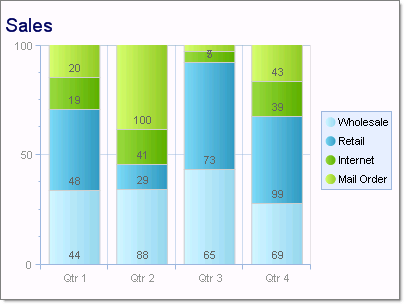
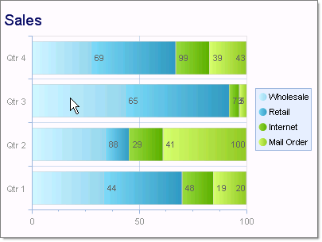

# Stacked Bar 100% Charts

## 

Stacked Bar 100 charts are used when you have three or more data series and want to compare distributions within categories, and at the same time display the differences between categories. Each bar represents 100% of the amounts for that category.  

To create a Vertical Stacked Bar 100 Chart set the __SeriesOrientation__ property to __Vertical__. Set the RadChart __DefaultType__ property or __ChartSeries.Type__ to __StackedBar100__.
>caption 

To create a Horizontal Stacked Bar Chart set the __SeriesOrientation__ property to __Horizontal__. Set the RadChart __DefaultType__ property or __ChartSeries__.Type to __StackedBar100__.
>caption 

To display the label values as percentages, change the __DefaultLabelValue__ for each chart series from "#Y" (the numeric value for each data point) to "#%" (the percentage of each data point to the category).
        
