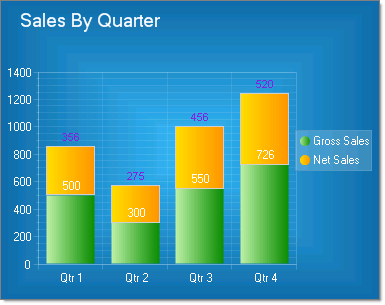
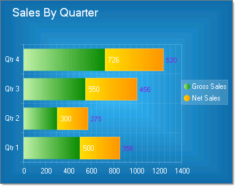

# Stacked Bar Charts

## 

Stacked bar charts are used to compare contributions of values to a total across categories. In the examples below the categories are various sources for sales (Internet, Wholesale, Retail) that combine to make the total sales for each quarter. Use the Stacked Bar chart when you need visibility to the combined values for each category.

To create a Vertical Stacked Bar Chart set the __SeriesOrientation__ property to __Vertical__. Set the RadChart __DefaultType__ property or __ChartSeries.Type__ to __StackedBar__.
>caption 

 
To create a Horizontal Stacked Bar Chart set the __SeriesOrientation__ property to __Horizontal__. Set the RadChart __DefaultType__ property or __ChartSeries.Type__ to __StackedBar__.

To display custom labeling on the X-Axis "Qtr 1", "Qtr 2", etc., set the RadChart __PlotArea.XAxis Autoscale__ property to False.  Use the __PlotArea.XAxis.Items__ property and for each item set the __TextBlock Text__ property to the desired label.
        
