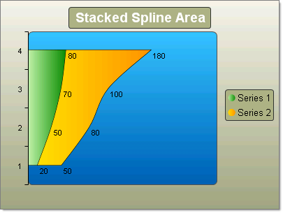

# Stacked Spline Area Charts

## 

The Stacked Spline Area chart is a variation of the Spline Area chart. The areas are stacked so that each series adjoins but does not overlap the preceding series.  This contrasts with the Stacked Area chart where each series overlays the preceding series. 

To create a simple vertical Stacked Spline Area Chart set the __SeriesOrientation__ property to __Vertical__. Set the RadChart __DefaultType__ property or __ChartSeries.Type__ to __StackedSplineArea__. Create multiple chart series and add chart items with Y or X and Y values.

To create a simple vertical Stacked Spline Area Chart set the __SeriesOrientation__ property to __Horizontal__. Set the RadChart __DefaultType__ property or __ChartSeries.Type__ to __StackedSplineArea__. Create multiple chart series and add chart items with Y or X and Y values.
>caption 

