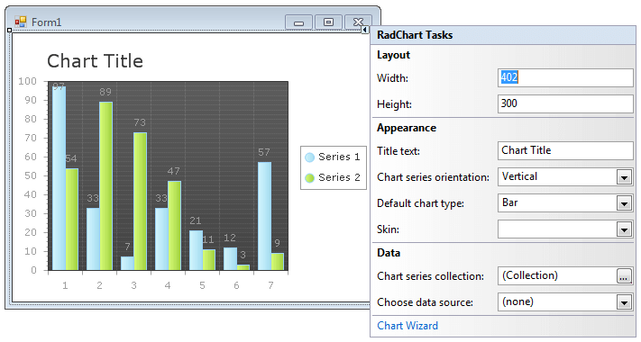

# RadChart SmartTag Menu

## 

To easily access common tasks and properties click the SmartTag at the upper right corner of the RadChart.
>caption 

Here you can find the most significant properties for the chart without navigating to the Properties Window.  RadChart Tasks are divided into four sections: 

__Layout:__

* Assign __Width__ and __Height__ properties in pixels to set the dimensions for the chart as a whole.

__Appearance__: 

* __Title text__: Set the chart title using the "Title text" entry. If you need more control over the title appearance, content and position see the [Titles]() help topic. 

* __Chart Series Orientation:__ Choose Horizontal or Vertical orientation for the chart from the drop down list. 

* __Default Chart Type:__ Select one of the 16 chart types from the drop down list.  See [RadChart Types Overview]() for more information. 

* __Set the series palette:__ Select a predefined series color palette from the drop down list.

__Data__:

* __Chart series collection:__ Click the ellipses button to display the ChartSeries Collection Editor dialog.  From there you can manually add series and series items to your chart. See the [Populate RadChart at Design-Time]() topic for more information.

* __Choose data source:__ Click the drop down list to select or create a data source. For more information see the [Data Binding RadChart]() topic. 

__Setting:__

* __Chart image format__: Charts are rendered in the browser as images. Use this drop down list to define what image format will be used. 

* __Chart Wizard:__ Click this link to open the Chart Wizard dialog.  The Chart Wizard helps you navigate the many properties of RadChart.  See the [RadChart Wizard]() for more information.
