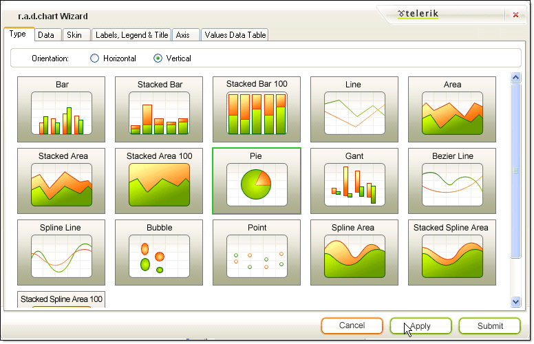

# RadChart Wizard

## 

The RadChart Wizard helps you traverse the many properties of RadChart by providing the most commonly used properties in an intuitive way.  The wizard can help you quickly set up the basic structure of your chart. You can invoke the chart wizard from the RadChart [Smart Tag](), from the context menu that appears when you right-click RadChart and from the link at the bottom of the properties window.

The RadChart Interface consists of tabs: 

* [Type]()

* [Data]()

* [Skin]()

* [Labels, Legend & Title]()

* [Axis]()

* [Values Data Table]()
* 
