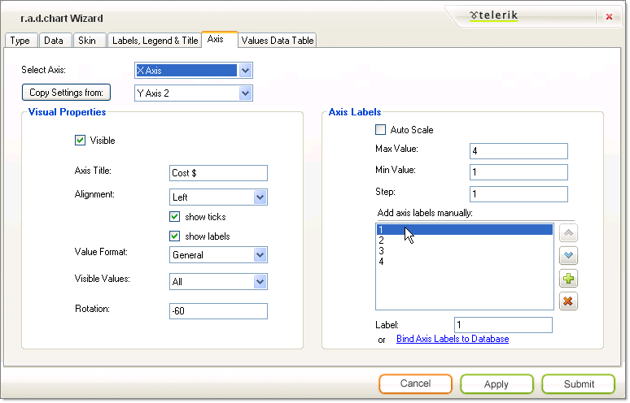
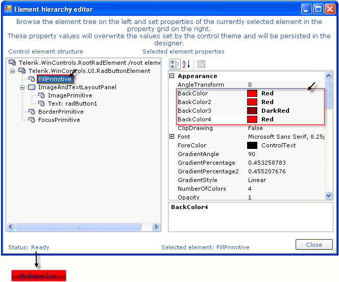

# The Wizard Axis Tab

The __Axis__ tab lets you select an axis from the drop down list at the top of the page.  You can then modify the properties below and they will be retained for the selected axis.  Use the __Copy Settings From__ button to replicate settings from another axis.

## Visual Properties

The __Visual Properties__ section of the page controls properties for the axis as a whole.  

* Uncheck the __Visible__ checkbox to hide the entire axis (including labels and tick marks).

* __Axis Title__ text populates a single label that appears for the axis as a whole.  

* Use the __Alignment__ property to place the axis label in a predefined position, e.g. Left, Right, Top, Bottom, Center, TopRight, TopLeft, BottomRight, BottomLeft.

* Uncheck __Show Ticks__ to hide the [axis tick marks](). 

* Uncheck __Show Labels__ to hide the axis labels (but not the Axis Title).  

* The __Value Format__ drop down list automatically formats axis labels as various kinds of dates, times, percentages, numbers and currency.

* __Visible Values__ can be All, Positive or Negative values.

* __Rotation__ is used to rotate the axis label text. Positive numbers spin the labels clockwise, negative numbers counter-clockwise.

## Axis Labels

* Turn off __Auto Scale__ if you want to provide custom axis labels instead of the default numeric values. Turning off Auto Scale also lets you use the __Min__, __Max__ and __Step__ values.

* Enter __Min__ and __Max__ values to control the number of series items to be displayed along that axis. Enter a __Step__ value to control the interval between axis labels.

* If Auto Scale is off you can use the provided list box to add, delete and reorder axis label items manually. By selecting any one of the axis label values in the listbox you can assign a text label.

* Click the __Bind Axis Labels to Database__ link to navigate back to the [Data tab]().
>caption 

The settings in the Axis Tab shown above result in the following X Axis labeling example: 
>caption 

