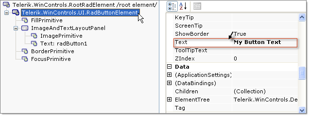

# The Wizard Labels, Legend and Titles Tab

## 

On the __Labels, Legend and Titles__ Tab: 

* __Title:__ From this portion of the tab set the __Text__ for the title, toggle visibility of the title using the checkbox provided and set text direction from the drop down list. Use the __Alignment__ drop down to move the title position between None, Left, Top, Bottom, Center, TopRight, TopLeft, BottomRight and BottomLeft. 

* __Legend:__ Unselect the Visible checkbox to hide the legend. Use the __Marker__ drop down to select from a predefined list of shapes.  In the example below the Rectangle shape is selected. Use the __Alignment__ drop down to move the legend position between None, Left, Top, Bottom, Center, TopRight, TopLeft, BottomRight and BottomLeft. In the example below the legend is moved to the upper right corner.`If you hide the legend, the extra space at the right of the screen remains. Use the PlotArea.Appearance.Dimensions.Margins to add or remove buffer space around the [plot area]().

* __Series Labels__: This section lets you set label properties for a series name selected in the Series drop down list.  Uncheck the __Visible__ box to hide the series labels.  Enter a value between 0 and 360 to the __Rotation__ entry to rotate all series labels at one time.  In the example below the labels are rotated 330 degrees. Positive __Rotation__ values rotate the labels clockwise, negative values rotate the labels counter-clockwise. Positive __Distance__ values move the labels away from the chart series items. The example below has a distance of 60. 

>caption 

