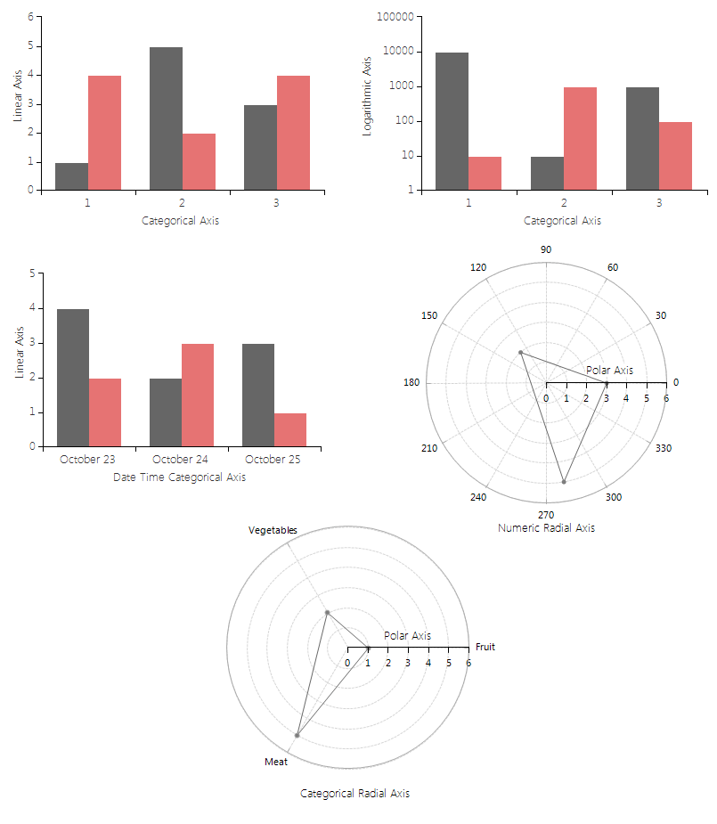
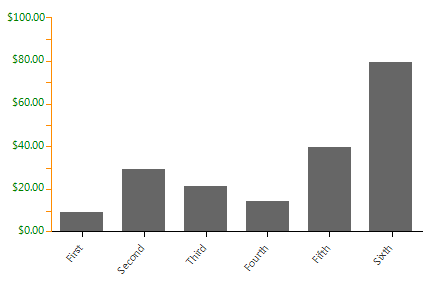

# Axes

Each __RadChartView__ area type uses a different set of axes to plot its data points. For example, Cartesian Area supports the following axes: __Categorical__, __Linear__, __Logarithmic__, __DateTimeCategorical__ and __DateTimeContinuous__. Polar area, however, renders its data upon Polar and Radar axes only. Note that Pie area does not support axes. This article discusses the common characteristics of the abstract class Axis, which is the single class all __RadChartView__ axes derive from. This class is responsible for displaying major and minor ticks and rendering the labels associated with the ticks. It also introduces several important properties:

* __AxisType:__ The property sets the axis to be either First or Second.

* __LabelFitMode:__ Gets or sets a value that determines how the axis labels will be laid out when they overlap.  The property specifies the approach the axis will use to handle label collision. The possible fit modes are None, Multiline and Rotate. None renders the all labels at their specified location without applying any fit logic. Multiline displays labels on a number of rows and Rotate turns the labels around a fixed point. Note that Multiline mode repositions the labels only if it is needed, while Rotate affects the labels regardless of the available space.

* __LabelRotationAngle:__ Gets or sets the rotation angle of the labels when LabelFitMode equals Rotate.

* __LabelFormat:__ Applies a predefined format to the label contents.

* __LabelFormatProvider:__ Supplies an object that provides formatting information.

* __LabelInterval:__ Gets or sets the step at which labels are positioned. Specifies the value indicating that only the first out of n-axis labels is visible, where n is the value of the property. Setting the value to 2 makes every second label disappear and setting it to 3 makes only the first of each three labels visible.

* __LabelOffset:__ Gets or sets index-based offset of the first tick to be displayed. Setting this property to 1 makes the first label disappear; setting it to 3 makes the first three labels hidden. Note that the property only hides the labels. To hide the ticks use MajorTickOffset property.

* __LastLabelVisibility:__ Specifies whether the last label should be Clipped, Visible or Hidden.

* __LineWidth:__ The property specifies the width of the axis.

* __MajorTickOffset:__ Gets or sets index-based offset of the first tick to be displayed.

* __TickLength:__ Gets or sets the length of major ticks.

* __TickWidth:__ Gets or sets the thickness of a single tick present on the axis.

* __Title:__ Specifies the title of the axis.

* __ShowLabels:__ A Boolean property that indicates whether the labels will be rendered or hidden.

* __BorderColor:__ The property sets the color used to draw the axis and the ticks

* __ForeColor:__ Determines the color used to render the labels of the axis

* __BorderWidth:__ The property specifies the width of the axis

* __EnableElementCache:__ Determines whether the axis labels will be cached or not.

>note The EnableElementCache property is by default set to *true*. In scenarios requiring frequent updates in the chart`s data points it is recommended to set the property to *false*.

>caption Figure 1: Axes Types


The following example demonstrates how some of the above properties are set: 

#### Set Properties

{{source=..\SamplesCS\ChartView\Axes\AxisForm.cs region=axis}} 
{{source=..\SamplesVB\ChartView\Axes\AxisForm.vb region=axis}} 

````C#
BarSeries series = new BarSeries();
series.DataPoints.Add(new CategoricalDataPoint(10, "First"));
series.DataPoints.Add(new CategoricalDataPoint(30, "Second"));
series.DataPoints.Add(new CategoricalDataPoint(22, "Third"));
series.DataPoints.Add(new CategoricalDataPoint(15, "Fourth"));
series.DataPoints.Add(new CategoricalDataPoint(40, "Fifth"));
series.DataPoints.Add(new CategoricalDataPoint(80, "Sixth"));
this.radChartView1.Series.Add(series);
CategoricalAxis categoricalAxis = radChartView1.Axes[0] as CategoricalAxis;
categoricalAxis.PlotMode = AxisPlotMode.OnTicksPadded;
categoricalAxis.LabelFitMode = AxisLabelFitMode.Rotate;
categoricalAxis.LabelRotationAngle = 310;
LinearAxis verticalAxis = radChartView1.Axes[1] as LinearAxis;
verticalAxis.ForeColor = Color.Green;
verticalAxis.BorderColor = Color.DarkOrange;
verticalAxis.MajorStep = 10;
verticalAxis.Maximum = 100;
verticalAxis.Minimum = 0;
verticalAxis.LabelInterval = 2;
verticalAxis.LabelFormat = "{0:c}";

````
````VB.NET
Dim series As New BarSeries()
series.DataPoints.Add(New CategoricalDataPoint(10, "First"))
series.DataPoints.Add(New CategoricalDataPoint(30, "Second"))
series.DataPoints.Add(New CategoricalDataPoint(22, "Third"))
series.DataPoints.Add(New CategoricalDataPoint(15, "Fourth"))
series.DataPoints.Add(New CategoricalDataPoint(40, "Fifth"))
series.DataPoints.Add(New CategoricalDataPoint(80, "Sixth"))
Me.RadChartView1.Series.Add(series)
Dim categoricalAxis As CategoricalAxis = TryCast(RadChartView1.Axes(0), CategoricalAxis)
categoricalAxis.PlotMode = AxisPlotMode.OnTicksPadded
categoricalAxis.LabelFitMode = AxisLabelFitMode.Rotate
categoricalAxis.LabelRotationAngle = 310
Dim verticalAxis As LinearAxis = TryCast(RadChartView1.Axes(1), LinearAxis)
verticalAxis.ForeColor = Color.Green
verticalAxis.BorderColor = Color.DarkOrange
verticalAxis.MajorStep = 10
verticalAxis.Maximum = 100
verticalAxis.Minimum = 0
verticalAxis.LabelInterval = 2
verticalAxis.LabelFormat = "{0:c}"

````

{{endregion}} 

Having the **BorderColor** property of the axis set to a color different than the one defined in the theme will also set the border color of the axis labels. As this might not be desired one can access each of the labels and explicitly set their **BorderColor** to *Transparent*. A suitable place for this is the **Shown** event of the form

#### Labels Border Color

{{source=..\SamplesCS\ChartView\Axes\AxisForm.cs region=ShownEvent}} 
{{source=..\SamplesVB\ChartView\Axes\AxisForm.vb region=ShownEvent}}
````C#
private void AxisForm_Shown(object sender, EventArgs e)
{
    LinearAxis verticalAxis = (LinearAxis)this.radChartView1.Axes[1];
    foreach (var item in verticalAxis.Children)
    {
        AxisLabelElement labelElement = item as AxisLabelElement;
        if (labelElement != null)
        {
            labelElement.BorderColor = Color.Transparent;
        }
    }
}

````
````VB.NET
Private Sub AxisForm_Shown(sender As Object, e As EventArgs)
    Dim verticalAxis As LinearAxis = CType(Me.RadChartView1.Axes(1), LinearAxis)
    For Each item In verticalAxis.Children
        Dim labelElement As AxisLabelElement = TryCast(item, AxisLabelElement)
        If labelElement IsNot Nothing Then
            labelElement.BorderColor = Color.Transparent
        End If
    Next
End Sub

```` 


{{endregion}} 

>caption Figure 2: Property Settings


## See Also

* [Getting Started]()
* [Populating with Data]()
* [Series Types]()
* [Tips and Tricks to Optimize RadChartView's Performance]()