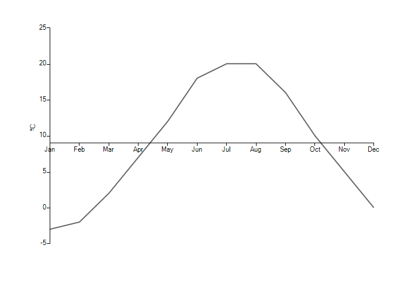
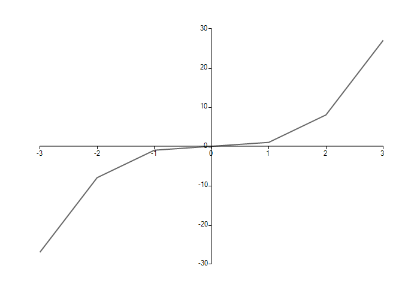

# Axis Alignment

The __StartPositionAxis__ and the __StartPositionValue__ properties of the abstract __CartesianAxis__ class provide a functionality for fine positioning of the axes of a __RadChartView__.

* __StartPositionAxis:__ Defines the axis along which the current axis will be aligned.

* __StartPositionValue:__ Defines the location where the current axis should be positioned.

## One Axis Offset

This example sets offset of the horizontal axis along the vertical axis. 

#### One Axis Offset

<snippet id='chartview-axis-alignment-one-axis-offset-cs'/>
<snippet id='chartview-axis-alignment-one-axis-offset-vb'/>

>caption Figure 1: One Axis Offset

## Two Axes Offset

This example sets offset offset of the two axes of the __RadChartView__. 

#### Two Axis Offset

<snippet id='chartview-axis-alignment-two-axes-offset-cs'/>
<snippet id='chartview-axis-alignment-two-axes-offset-vb'/>

>caption Figure 2: Two Axis Offset

# See Also

* [Axes]()
* [Series Types]()
* [Populating with Data]()
