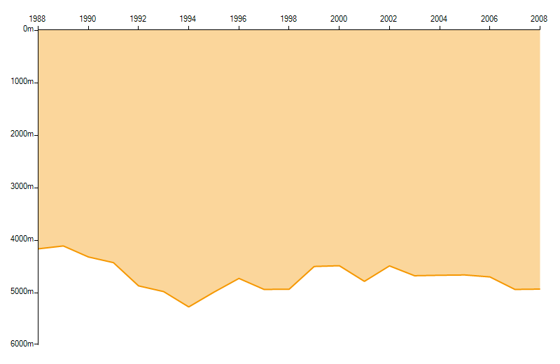

# Inverse Axis

The __IsInverse__ property of the abstract __LineAxis__ class determines whether an axis of a __RadChartView__ will be reversed. In certain areas in engineering or physics it is a standard for some data representation an axis to be inverse.

## Vertical Axis Inversion

This example will demosntrate the depths of crude oil wells in the period between 1988 and 2008.

#### Axis Inversion

<snippet id='chartview-inverse-axis-inverse-axis-cs'/>
<snippet id='chartview-inverse-axis-inverse-axis-vb'/>

>caption Figure 1: Inverse Axis

# See Also

* [Axes]()
* [Series Types]()
* [Populating with Data]()
