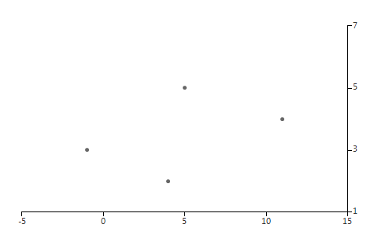

# Linear

__RadChartView__ uses Linear axes to plot data containing numerical values. Valid only in the context of Cartesian Area, this axis is created by default when you add Bar, Line, Area and Scatter series. It automatically calculates the Maximum, Minimum and MajorStep properties, based on the incoming data. Here is a list of all LinearAxis properties:

* __ActualRange:__ The property provides the actual range (the minimum and maximum) used by the axis to plot data points.

* __DesiredTickCount:__ Gets or sets the user-defined number of ticks on the axis.

* __Minimum:__ Gets or sets the user-defined minimum of the axis. By default the axis calculates the minimum, depending on the minimum of the plotted data points. You can reset this property by setting it to Double.NegativeInfinity to restore the default behavior.

* __Maximum:__ Gets or sets the user-defined maximum of the axis. By default the axis calculates the maximum, depending on the maximum of the plotted data points. You can reset this property by setting it to Double.PositiveInfinity to restore the default behavior.

* __MajorStep:__ The property determines the major step between each axis tick. By default the axis calculates the major step, depending on the plotted data points. You can reset this property by setting it to 0 to restore the default behavior.

* __RangeExtendDirection:__ Gets or sets a value that specifies how the auto-range of this axis is extended so that each data point is visualized in the best way. Possible values are None, Positive, Negative, Both. None sets the range minimum to the minimum data point value and the range maximum to the maximum data point value. Positive extends the range maximum with one major step if necessary. Negative extends the range minimum with one major step if necessary. Both extend the range in both negative and positive direction.

* __HorizontalLocation:__ The property determines the horizontal location of the axis in relation to the plot area. Possible values are Top and Bottom, where Top displays the axis above the area and Bottom displays the axis below the area. The default value is Bottom.

* __VerticalLocation:__ The property determines the vertical location of the axis in relation to the plot area. Possible values are Left and Right, where Left displays the axis on the left of the area and Right displays the axis on the right of the area. The default value is Left.

* __ClipLabels:__ This property controls whether labels will be clipped to the size of the axes (width/height).

Additionally, LinearAxis inherits all properties of the Axis class.

Here is how to set properties of the LinearAxes: 

#### LinearAxis Setup

<snippet id='chartview-linear-axis-cs'/>
<snippet id='chartview-linear-axis-vb'/>

>caption Figure 1: LinearAxis Setup

# See Also

* [Axes]()
* [Series Types]()
* [Populating with Data]()
