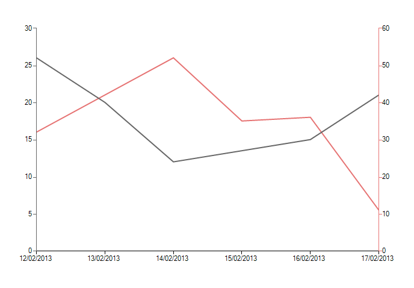
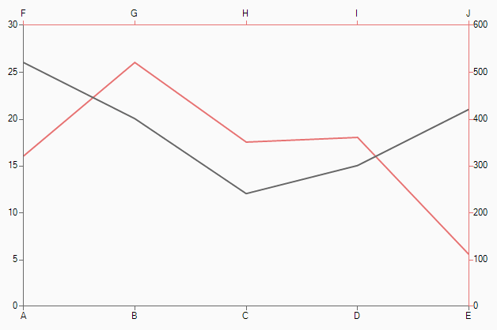
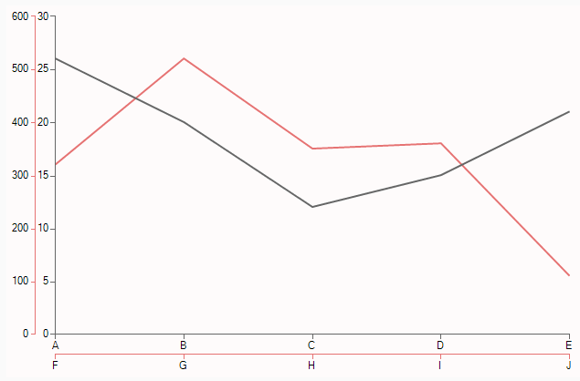
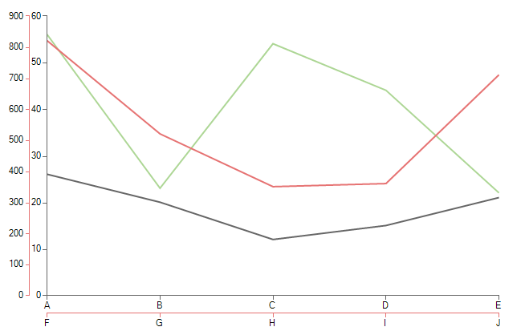

# Multiple axes

| RELATED VIDEOS |  |
| ------ | ------ |
|[WinForms RadChartView Multi-Axes Support in RadChartView](http://tv.telerik.com/watch/radcontrols-for-winforms/multi-axes-support-in-radchartview) The Multi-Axes feature of __RadChartView__ introduces a whole new realm of data visualization possibilities.  Now you can visualize data from multiple sources plotted against a common axis all in the same chart. This allows you to make better decisions with the data, identify patterns and relationships, or simply save form real estate in your application by combining multiple charts into one.||RadChartView allows you to easily set up a chart with multiple axes. There are three types of multi axes charts one can create:

* The first is a chart where two or more series share one axis and have different second axes.

* The second is a chart where each series has its own pair of axes, the series only share the chart view where they are plotted.

* The third one is simply a mix of the previous two.

When in multi axis mode __RadChartView__ will automatically synchronize the color of the axes with the color of the series.

There are several things to consider when setting up a multi axis chart. Each series must have one axis of type First and one of type Second. You have to assign axes to the series before adding them to RadChartView, otherwise default axes will be assigned to the series.

## One common axis

The following example shows how to create a chart with two series sharing their categorical axis. The most common use case for this type of chart is when you have to plot data of different dimensions.

>caption Figure 1: One Common Axis

#### One Common Axis

<snippet id='chartview-multiple-axes-setuponecommonaxis-cs'/>
<snippet id='chartview-multiple-axes-setuponecommonaxis-vb'/>

## Each series with own axes

If you need series to have different axes but still plot them on one chart view you can assign the axes to the series and add them to the chart view

>caption Figure 2: All Sides
 

>caption Figure 3: Two Sides

#### Setup Four Axes

<snippet id='chartview-multiple-axes-setuptwoseriesfouraxes-cs'/>
<snippet id='chartview-multiple-axes-setuptwoseriesfouraxes-vb'/>

## Mixed multi axes

Mixing the above two modes:

>caption Figure 4: Mixed Multi Axes

<snippet id='chartview-multiple-axes-setupmixed-cs'/>
<snippet id='chartview-multiple-axes-setupmixed-vb'/>

# See Also

* [Axes]()
* [Series Types]()
* [Populating with Data]()
