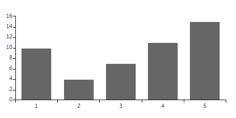
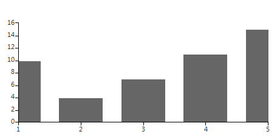
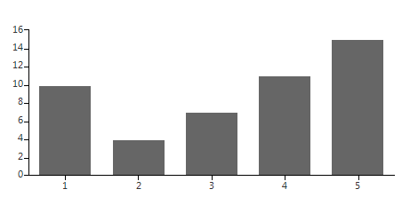

# Plot Mode

The __PlotMode__ property appears only in the __Categorical__, __DateTimeCategorical__ and __DateTimeContinuous__ axes. It defines the __AxisPlotMode__ used by the axis to plot the data. Possible values are *BetweenTicks*, *OnTicks*, *OnTicksPadded*, where:

* __BetweenTicks__  plots points in the middle of the range, defined by two ticks.

* __OnTicks__  plots the points over each tick.

* __OnTicksPadded__ plots points over each tick with half a step padding applied on both ends of the axis.

The following example creates a CategoricalAxis and assigns it to a BarSeries before the series is added to the RadChartView. If the HorizontalAxis property of the series is assigned at the moment of inserting it in the Series collection, the chart will use the axis determined by the property. Alternatively, if the property is null, the chart will create and assign a default axis. The following snippet sets the PlotMode of the horizontalAxis to BetweenTicks and the GapLength to 0.3. Mode information on the GapLength can be found under the [Series Types / BarSeries article.]()

#### BetweenTicks PlotMode

<snippet id='chartview-plot-mode-axis-cs'/>
<snippet id='chartview-plot-mode-axis-vb'/>

>caption Figure 1: BetweenTicks PlotMode

You can always change the PlotMode property, even if the CategoricalAxis was auto-generated, using the Get() method of the Axes collection. The following snippet changes the PlotMode to OnTicks: 

#### OnTicks PlotMode

<snippet id='chartview-plot-mode-axis2-cs'/>
<snippet id='chartview-plot-mode-axis2-vb'/>

>caption Figure 2: OnTicks PlotMode

Using the aforementioned approach you can set the PlotMode property to OnTicksPadded: 

#### OnTicksPadded PlotMode

<snippet id='chartview-plot-mode-axis3-cs'/>
<snippet id='chartview-plot-mode-axis3-vb'/>

>caption Figure 3: OnTicksPadded PlotMode

# See Also

* [Axes]()
* [Series Types]()
* [Populating with Data]()
