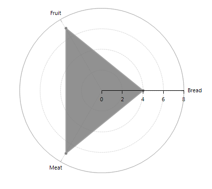
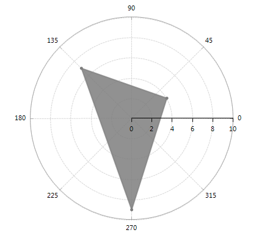

# Radial

__RadChartView__ supports two Radial axes out of the box – __CategoricalRadialAxis__ and __NumericRadialAxis__. The former is used to plot categorical data and the latter to render numerical data.

[CategoricalRadialAxis](#categoricalradialaxis)
[NumericRadialAxis](#numericradialaxis)

## CategoricalRadialAxis

__CategoricalRadialAxis__ introduces the following property:

* __MajorTickInterval__ – defines the step at which ticks are positioned. The value indicates that the first of n axis ticks is visible, where n is the value of the property.

Additionally, __CategoricalRadialAxis__ inherits all properties of the [Axis class.]()

CategoricalRadial axis is added automatically when you add RadarPoint, RadarLine or RadarArea series to RadChartView. The following example illustrates that once you add a Radar series, you are able to get the CategoricalRadial axis using the RadialAxis property of the RadarSeries instance: 

#### CategoricalRadialAxis Setup

<snippet id='chartview-radial-radialcategoricalaxis-cs'/>
<snippet id='chartview-radial-radialcategoricalaxis-vb'/>

>caption Figure 1: CategoricalRadialAxis Setup

## NumericRadialAxis

NumericRadialAxis contains the following important properties:

* __MajorStep:__ Defines the step between two adjacent ticks on the axis. Specify TimeSpan.Zero to clear the value. If not specified, the step is automatically determined, depending on the smallest difference between any two dates.

* __DesiredTickCount:__ Gets or sets the user-defined number of ticks on the axis.

* __RangeExtendDirection:__ Gets or sets a value that specifies how the auto-range of this axis is extended so that each data point is visualized in the best way. Possible values are None, Positive, Negative, Both. None sets the range minimum to the minimum data point value and the range maximum to the maximum data point value. Positive extends the range maximum with one major step if necessary. Negative extends the range minimum with one major step if necessary. Both extend the range in both negative and positive direction.

Additionally, NumericRadialAxis inherits all properties of the [Axis class.]()

NumericRadial axis is added automatically when you add __PolarPoint__, __PolarLine__ or __PolarArea__ series to __RadChartView__. The following example illustrates that once you add a Polar series, you are able to get the NumericRadial axis using the __RadialAxis__ property of the __PolarSeries__ instance: 

#### NumericRadialAxis Setup

<snippet id='chartview-radial-radialnumericalaxis-cs'/>
<snippet id='chartview-radial-radialnumericalaxis-vb'/>

>caption Figure 1: NumericRadialAxis Setup

# See Also

* [Axes]()
* [Series Types]()
* [Populating with Data]()
