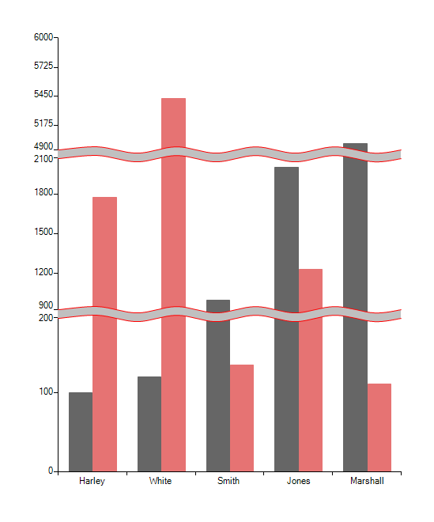

# Scale Breaks

The ScaleBreaks feature allows you to "break off" large chunks of the axis so that graphs with large amplitude are easier to read. ScaleBreaks are available for both axes of the plot area.

>important This feature assumes the __CombinedMode__ property of the series to be *ChartSeriesCombineMode.Cluster*, which is also its default setting. 
>

To add a scale break you show use the __ScaleBreaks__ collection of the axis. First, you need to create an __AxisScaleBreak__ item and set its __From__  and __To__ properties (you can set the __Name__ property as well):

#### ScaleBreak Initial Setup

{{source=..\SamplesCS\ChartView\Axes\ScaleBreaksCode.cs region=Break1}} 
{{source=..\SamplesVB\ChartView\Axes\ScaleBreaksCode.vb region=Break1}} 

````C#
LinearAxis verticalAxis = radChartView1.Axes.Get<LinearAxis>(1);
AxisScaleBreak scaleBreakItem = new AxisScaleBreak();
scaleBreakItem.Name = "Item1";
scaleBreakItem.From = 200d;
scaleBreakItem.To = 900d;
verticalAxis.ScaleBreaks.Add(scaleBreakItem);
AxisScaleBreak scaleBreakItem1 = new AxisScaleBreak();
scaleBreakItem.Name = "Item2";
scaleBreakItem1.From = 2100d;
scaleBreakItem1.To = 4900;
verticalAxis.ScaleBreaks.Add(scaleBreakItem1);

````
````VB.NET
Dim verticalAxis As LinearAxis = radChartView1.Axes.Get(Of LinearAxis)(1)
Dim scaleBreakItem As New AxisScaleBreak()
scaleBreakItem.Name = "Item1"
scaleBreakItem.From = 200.0R
scaleBreakItem.To = 900.0R
verticalAxis.ScaleBreaks.Add(scaleBreakItem)
Dim scaleBreakItem1 As New AxisScaleBreak()
scaleBreakItem.Name = "Item2"
scaleBreakItem1.From = 2100.0R
scaleBreakItem1.To = 4900
verticalAxis.ScaleBreaks.Add(scaleBreakItem1)

````

{{endregion}}  

>caption Figure 1: ScaleBreak


## Scale Breaks Settings

The following properties allows you to customize the scale breaks:

* __Style:__ Allows you to change the style of the scale breaks. Three different styles are available:

  * *Straight*
  
  * *Waved*
  
  * *Ragged*

* __BackColor:__ Allows you to change the background of the scale break.

* __BorderColor:__ Controls the color of the scale break lines.

* __Size:__ Controls the distance between the scale break lines.

The following example shows how you can set the scale breaks settings: 

#### ScaleBreaks Settings

{{source=..\SamplesCS\ChartView\Axes\ScaleBreaksCode.cs region=Settings}} 
{{source=..\SamplesVB\ChartView\Axes\ScaleBreaksCode.vb region=Settings}} 

````C#
LinearAxis verticalAxis = radChartView1.Axes.Get<LinearAxis>(1);
verticalAxis.ScaleBreakStyle = ScaleBreakStyle.Waved;
verticalAxis.ScaleBreakBackColor = Color.Silver;
verticalAxis.ScaleBreakBorderColor = Color.Red;
verticalAxis.ScaleBreakSize = 10;

````
````VB.NET
Dim verticalAxis As LinearAxis = radChartView1.Axes.Get(Of LinearAxis)(1)
verticalAxis.ScaleBreakStyle = ScaleBreakStyle.Waved
verticalAxis.ScaleBreakBackColor = Color.Silver
verticalAxis.ScaleBreakBorderColor = Color.Red
verticalAxis.ScaleBreakSize = 10

````

{{endregion}} 

>caption Figure 2: ScaleBreaks Settings


# See Also

* [Axes]()
* [Series Types]()
* [Populating with Data]()
