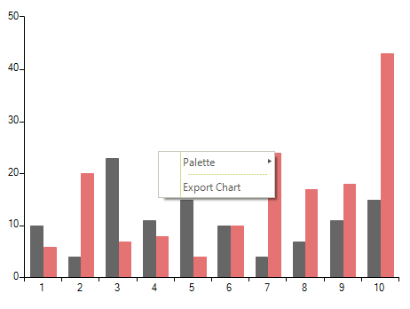

# Modifying the Default Context Menu

The default __RadChartView__ context menu can be customized in the __ContextMenuOpening__ event handler.

## New Menu Item

In order to add custom menu items to the default context menu, you should create menu item instances in the __ContextMenuOpening__ event handler and add them to the __e.ContextMenu.Items__ collection. The following example adds an item responsible for exporting the chart to an image.

>caption Figure 1: Modified Context Menu


#### Subscribe to Event

{{source=..\SamplesCS\ChartView\ContextMenu\RadChartViewContextMenuForm.cs region=SubscribeToEvent}} 
{{source=..\SamplesVB\ChartView\ContextMenu\RadChartViewContextMenuForm.vb region=SubscribeToEvent}}
````C#
this.radChartView1.ContextMenuOpening += radChartView1_ContextMenuOpening;

````
````VB.NET
AddHandler RadChartView1.ContextMenuOpening, AddressOf RadChartView1_ContextMenuOpening

```` 


{{endregion}}

#### Handle Event

{{source=..\SamplesCS\ChartView\ContextMenu\RadChartViewContextMenuForm.cs region=HandleEvent}} 
{{source=..\SamplesVB\ChartView\ContextMenu\RadChartViewContextMenuForm.vb region=HandleEvent}}
````C#
private void radChartView1_ContextMenuOpening(object sender, ChartViewContextMenuOpeningEventArgs e)
{
    RadMenuItem customMenuItem = new RadMenuItem();
    customMenuItem.Text = "Export Chart";
    customMenuItem.Click += customMenuItem_Click;
    RadMenuSeparatorItem separator = new RadMenuSeparatorItem();
    e.ContextMenu.Items.Add(separator);
    e.ContextMenu.Items.Add(customMenuItem);
}
private void customMenuItem_Click(object sender, EventArgs e)
{
   string filePath = @"..\..\..\exportedChart.png";
   this.radChartView1.ExportToImage(filePath, this.radChartView1.Size, System.Drawing.Imaging.ImageFormat.Png);
}

````
````VB.NET
Private Sub RadChartView1_ContextMenuOpening(sender As Object, e As ChartViewContextMenuOpeningEventArgs)
    Dim customMenuItem As New RadMenuItem()
    customMenuItem.Text = "Export Chart"
    AddHandler customMenuItem.Click, AddressOf CustomMenuItem_Click
    Dim separator As New RadMenuSeparatorItem()
    e.ContextMenu.Items.Add(separator)
    e.ContextMenu.Items.Add(customMenuItem)
End Sub
Private Sub CustomMenuItem_Click(sender As Object, e As EventArgs)
    Dim filePath As String = "..\..\..\exportedChart.png"
    Me.RadChartView1.ExportToImage(filePath, Me.RadChartView1.Size, System.Drawing.Imaging.ImageFormat.Png)
End Sub

```` 


{{endregion}}

# See Also

* [Axes]()
* [Series Types]()
* [Export]()
* [Printing]()
