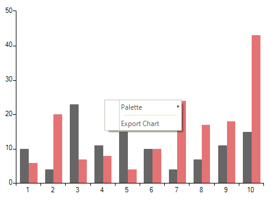

# Modifying the Default Context Menu

The default __RadChartView__ context menu can be customized in the __ContextMenuOpening__ event handler.

## New Menu Item

In order to add custom menu items to the default context menu, you should create menu item instances in the __ContextMenuOpening__ event handler and add them to the __e.ContextMenu.Items__ collection. The following example adds an item responsible for exporting the chart to an image.

>caption Figure 1: Modified Context Menu

#### Subscribe to Event

<snippet id='chartview-modifying-the-default-context-menu-subscribetoevent-cs'/>
<snippet id='chartview-modifying-the-default-context-menu-subscribetoevent-vb'/>

#### Handle Event

<snippet id='chartview-modifying-the-default-context-menu-handleevent-cs'/>
<snippet id='chartview-modifying-the-default-context-menu-handleevent-vb'/>

# See Also

* [Axes]()
* [Series Types]()
* [Export]()
* [Printing]()
