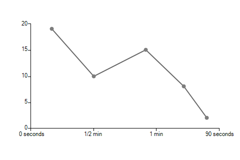
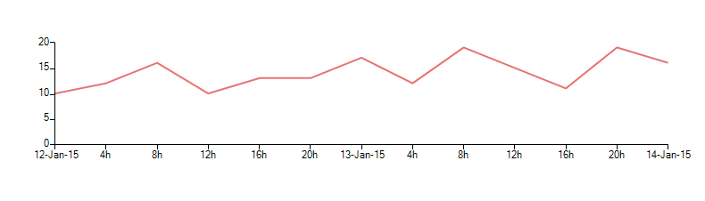

# Custom labels text

__RadChartView__ allows you to easily change the axes labels text by using a custom format provider class. This class must implement the [IFormatProvider](http://msdn.microsoft.com/en-us/library/system.iformatprovider.aspx) and [ICustomFormatter](http://msdn.microsoft.com/en-us/library/system.icustomformatter(v=vs.110).aspx) interfaces. The key point in this class is that the __Format__ method is called for each label and its "arg" parameter contains the current label text. The returned value will represent the new label.   

## Example 1: Changing the labels' texts to more human readable ones

#### Label Format

<snippet id='chartview-custom-labels-text-formatprovider-cs'/>
<snippet id='chartview-custom-labels-text-formatprovider-vb'/>

Then you can just change the horizontal axis __LabelFormatProvider__ by using the corresponding property. 

#### Assign Format Provider

<snippet id='chartview-custom-labels-text-propertychange-cs'/>
<snippet id='chartview-custom-labels-text-propertychange-vb'/>

>caption Figure 1: Format Provider

##  Example 2: Showing the date part of a label only on day changes 

#### DateTime Format Provider

<snippet id='chartview-custom-labels-text-formatprovider2-cs'/>
<snippet id='chartview-custom-labels-text-formatprovider2-vb'/>

  

Again you can just change the horizontal axis __LabelFormatProvider__ by using the corresponding property.  

#### Assign DateTime Format Provider

<snippet id='chartview-custom-labels-text-propertychange2-cs'/>
<snippet id='chartview-custom-labels-text-propertychange2-vb'/>

>caption Figure 2: DateTime Format Provider

>note The above provider implementation is applicable only to axes working with __DateTime__ objects  ( __DateTimeContinuousAxis__ and __DateTimeCategoricalAxis__ ).
>

# See Also

* [Series Types]()
* [Axes]()
