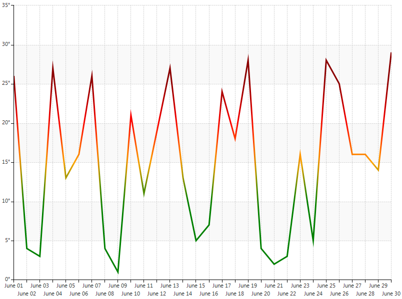
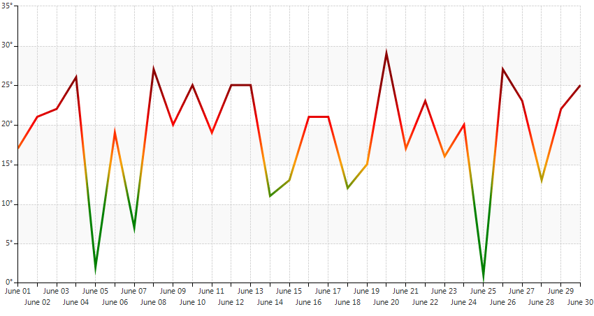

# Custom rendering

Typically, data points are rendered with different colors in order to indicate that they belong to different logical groups, i.e. series. Thus, if you intend to plot data of single series, all data points will be styled in the same manner. In certain cases, however, you may want customize the appearance of each data point in the series depending on its value in order to provide additional information about the plotted data. For example, values that fall into a critical range may be rendered in bright colors, so that they can be distinguished more easily. If you use BarSeries to visualize the data, it will be quite easy to achieve the desired outcome, since each bar is rendered individually, based on its BackColor and BorderColor properties. This is not the case, however, if you need to use LineSeries. This kind of series draws one line on a single pass which makes binding its values to predefined colors is a bit more complex task. The current article serves as a step-by-step tutorial on how to implement this scenario.

For the purpose of the article, let us make the following assumptions:

1. LineSeries should be used to plot the temperature data for a given region for one month.

1. The values of all 30 categorical data points fall in the range of 0 to 30  degrees.

1. Whenever the line of the series reaches certain value its color should change using the following scheme:

  * 10 degrees C - green

  * 15 degrees C - orange

  * 20 degrees C - red

  * 25 degrees C - dark red
                

The following image illustrates the desired outcome:

>caption Figure 1: Custom Rendering

The starting point of the article is a form with one __RadChartView__ on it. In the form’s Load event handler create a __LineSeries__ instance and add categorical data points. The current example generates random values that fall in the range of 0 – 30. After adding the series to the __RadChartView.Series__ collection, set the __LabelFormat__ and __LabelFitMode__ of the __HorizontalAxis__ and __VerticalAxis__ properties of 
the series to appropriate values. Further, subscribe to the __CreateRenderer__ of the chart and instantiate the __Renderer__ property of the event arguments to a new __CustomCartesianRederer__ instance. The __CreateRenderer__ event allows you to plug any custom implementation of chart renderer. Here is how your snippet should look like: 

#### Add Points and Create A Custom Renderer

<snippet id='chartview-custom-rendering-customrendererregion-cs'/>
<snippet id='chartview-custom-rendering-customrendererregion-vb'/>

 

Now you need to create a CustomCartesianRenderer class that inherits __CartesianRenderer__ and overrides the __Initialize__ method. This method creates and arranges draw parts responsible for the rendering of each __RadChartView__ segment. After calling the base method, the __DrawParts__ collection contains objects that know how to draw axes, labels, series etc. The particular draw part you would like to replace is of type __LineSeriesDrawPart__. Your code should be like the following: 

#### Custom Renderer Class

<snippet id='chartview-custom-rendering-customcartesianrendererregion-cs'/>
<snippet id='chartview-custom-rendering-customcartesianrendererregion-vb'/>

Let us further focus on the __CustomLineSeriesDrawPart__ implementation. To introduce custom rendering of the line you need to override the __DrawLine__ method and use the GraphicsPath object provided by the __GetLinePath__ method. In order to draw a path with gradient colors, you need to use a LinearGradientBrush and use its ColorBlend to set appropriate positions and colors. So, before we get to the CustomLineSeriesDrawPart class, let us create a class that will let us easily store Color-Position couples: 

#### Color Storage

<snippet id='chartview-custom-rendering-colorpositionblendregion-cs'/>
<snippet id='chartview-custom-rendering-colorpositionblendregion-vb'/>

  

Getting back to the CustomLineSeriesDrawPart, you need to create a method which calculates the positions and colors that need to be assigned to the ColorBlend of the brush. Additionally, you have to calculate the color of the points that fall between two predefined values, e.g. if the input value is 16, the color should be one fifth orange and four fifths red. Further, you have to make sure that the line segments between each two consecutive points are colored properly, regardless of points’ values. For example, if a point with value 0 is followed by a point with value 30, you need to ensure that the line that connects them does not go from green to dark red directly, but contains also orange and red when it crosses 15 and 20, respectively. Here is one possible implementation of the above scenario: 

#### DrawLine Method Implementation

<snippet id='chartview-custom-rendering-customlineseriesdrawpartregion-cs'/>
<snippet id='chartview-custom-rendering-customlineseriesdrawpartregion-vb'/>

 
 

After you compile the project, you should get a result similar to the screenshot below:

>caption Figure 2: Rendering Implementation Result

# See Also

* [Summary Labels on Stacked Bars]()
* [Series Types]()
* [Axes]()
* [How to Add Background Image to the Plot Area in ChartView]()
