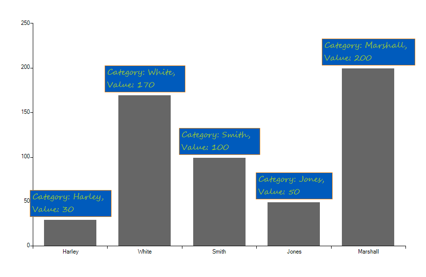

# Formatting Series Labels

This article demonstrates how to change the labels styles and text. The series labels can be customized in the __LabelFormatting__ event of __RadChartView__. This event is fired for each label, which allows you to customize all labels, depending on your goals.

>caption Figure 1: Formatting Labels

1\. In order this event to fire, you should set the __ShowLabels__ property to *true* for at least one series. For example, you can set this property for all series with the following code. 

#### Show Labels

<snippet id='chartview-formatting-series-labels-showlabels-cs'/>
<snippet id='chartview-formatting-series-labels-showlabels-vb'/>

 
 

2\. Now you can change the labels styles and text. 

#### LabelFormatting Event

<snippet id='chartview-formatting-series-labels-labelformatting-cs'/>
<snippet id='chartview-formatting-series-labels-labelformatting-vb'/>

>note Since **R2 2017 SP1** you can control the label's text alignment by the newly introduced property ChartViewLabelFormattingEventArgs.LabelElement.**TextAlignment**.

>important The code for getting the current data point can depend on the used series type. For example if you use pie chart you should cast to __PiePointElement__ , and __PieDataPoint__ types.
>

# See Also

* [Summary Labels on Stacked Bars]()
* [Series Types]()
* [Axes]()

