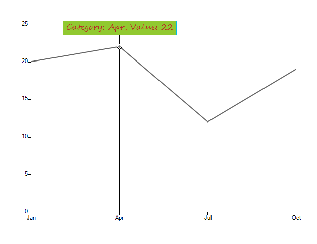

# Formatting Trackball Labels

This article demonstrates how to customize the trackball labels text and styles. This can be achieved in the __TextNeeded__ event of the trackball controller. This event is fired when the user hover over a particular data point with the mouse and can be used to set any styles and text, depending on your preferences.

>caption Figure 1: Formatting TrackBall

1\. You should subscribe to the __TextNeeded__ event and add the __ChartTrackballController__ to the chart as follows. 

#### Add Controller

<snippet id='chartview-formatting-trackball-labels-trackball-cs'/>
<snippet id='chartview-formatting-trackball-labels-trackball-vb'/>

 

2\. Now, you can use the __TextNeeded__ and change any properties you desire. 

#### Handle TextNeeded
	
<snippet id='chartview-formatting-trackball-labels-textneeded-cs'/>
<snippet id='chartview-formatting-trackball-labels-textneeded-vb'/>

  

>important The code for getting the current data point can depend on the used series type. For example if you use scatter chart, you should use __ScatterDataPoint__ type.
>

# See Also

* [Series Types]()
* [Axes]()
