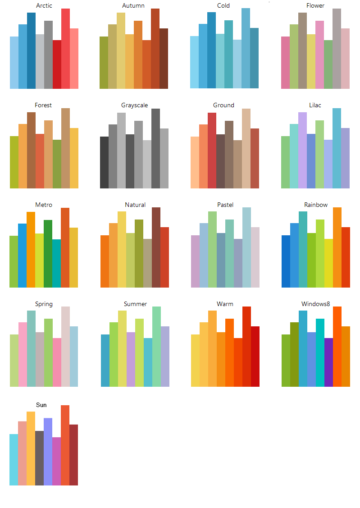
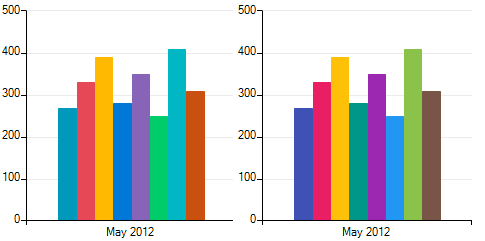
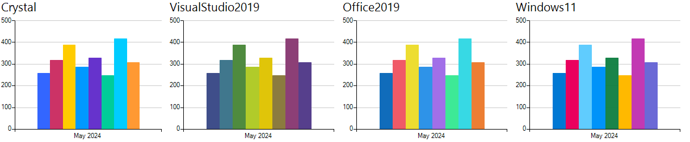
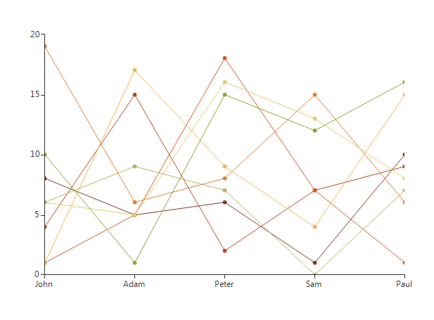
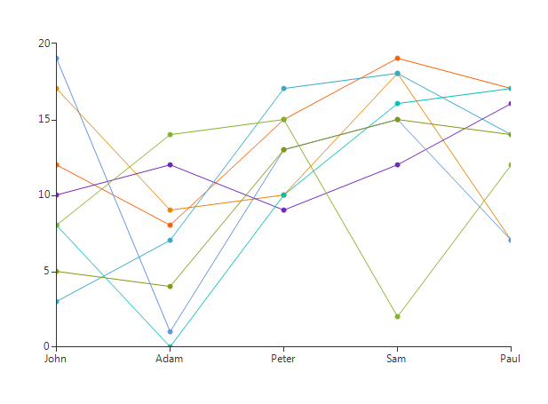
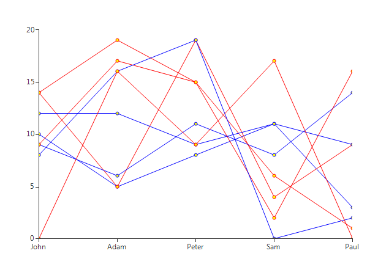

# Palettes

Palettes are a quick and easy way to define a skin for your chart view. A palette is a collection of several palette entries and each palette entry defines up to four colors – two fills and two strokes. Currently, only the Fill and Stroke properties are in use, the AdditionalFill and AdditionalStroke are not taken into consideration when applying a palette. 

>caption Figure 1: Palettes

As of **R1 2018 RadChartView** offers two new palettes: *Material* and *Fluent*.

>caption Material and Fluent palettes

As of **R2 2024 RadChartView** offers four new palettes: *Crystal*, *VisualStudio2019*, *Office2019*, *Windows11*.

>caption Crystal, VisualStudio2019, Office2019, Windows11 palettes

To apply one of these predefined palettes all you have to do is execute the following line of code:

#### Apply a Palette

<snippet id='chartview-palettes-palette-cs'/>
<snippet id='chartview-palettes-palette-vb'/>

Here is how two of the palettes look like in action:

>caption Figure 2: Autumn

>caption Figure 3: Windows 8

The predefined palettes consist of 8 palette entries which are applied to the series in a cyclic order. The first series is drawn with the colors from the first palette entry the second series is drawn with the colors form the second palette entry… the ninth series is drawn with the colors form the first palette entry and so on. If you would like to apply a palette entry specifically to a series you can do so using either one of the following line of code: 

#### Specific Palette Entry

<snippet id='chartview-palettes-sample-cs'/>
<snippet id='chartview-palettes-sample-vb'/>

Predefined palettes cannot be edited , however, you can define your own palettes by inheriting from __ChartPalette__ and creating a collection of palette entries. Here is an example: 

#### Create a Custom Palette

<snippet id='chartview-palettes-custompalette-cs'/>
<snippet id='chartview-palettes-custompalette-vb'/>

#### Apply a Custom Palette

<snippet id='chartview-palettes-setcustompalette-cs'/>
<snippet id='chartview-palettes-setcustompalette-vb'/>

>caption Figure 4: Custom Palette

# See Also

* [Series Types]()
* [Axes]()
