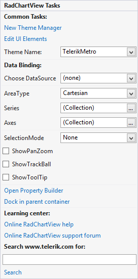

# Smart Tag

In this article we will describe the design time abilities of __RadChartView__. 

>note A step by step tutorial for design-time data binding is available in the [Getting Started]() article. Advanced design-time editing and customization can be achieved by utilizing the [Property Builder]() of __RadChartView__.
>

Here is how the control's Smart Tag looks like:

>caption Figure 1: Smart Tag

* __Common Tasks__

	* __New Theme Manager__: Adds a new __RadThemeManager__ component to the form.

	* __Edit UI elements__: Opens a dialog that displays the *Element Hierarchy Editor*. This editor lets you browse all the elements in the control.

	* __Theme Name__: Select a theme name from the drop down list of themes available for that control. Selecting a theme allows you to change all aspects of the controls visual style at one time.

* __Data Binding__: RadChartView utilizes the standard WinForms data binding mechanism. A complete example is available in [Getting Started]().

* __RadChartView Specific Actions__:
	
	* __AreaType__: Allows you to switch between the three area types – Cartesian, Polar and Pie
	
	* __Series__: A collection of ChartSeries – Area, SplineArea, Bar, Line, Spline, Scatter point, Combined series

	* __Axes__: A collection of Axes
	
	* __SelectionMode__: Allows you to define the desired selection mode – None, SingleDataPoint or MultipleDataPoints            
	
	* __ShowPanZoom__: Defines whether trackball should be enabled
	
	* __ShowTrackBall__: Defines whether trackball should be enabled

	* __ShowToolTip__: Defines whether tooltips should be shown

* __Learning Center__: Navigate to the Telerik help, code library projects or support forum.

* __Search__: Search the Telerik website for a given string.

All of these properties are also available in the Properties window of Visual Studio.

# See Also

* [Property Builder]()
* [Getting Started]()
* [Element Hierarchy Editor]()
