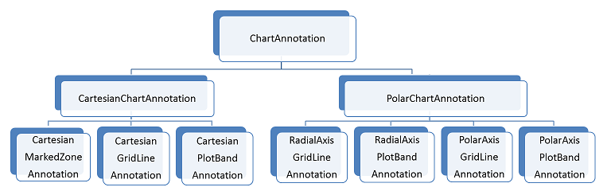

# Annotations

Annotations are visual elements that can be used to highlight certain areas on the plot area and denote significant values.

__RadChartView__ provides the following types of annotations:

* __Cartesian grid line__

* __Cartesian plot band__

* __Cartesian marked zone__

* __Polar axis grid line (associated with the polar axis)__

* __Polar axis plot band (associated with the polar axis)__

* __Polar axis grid line (associated with the radial axis)__

* __Radial axis plot band (associated with the radial axis)__

>caption Figure 1: Chart Annotations

# Common Properties

|Property|Description|
|----|----|
|**ClipToPlotArea**|Gets or sets a value indicating whether this instance will be clipped to the bounds of the plot area.|
|**DrawMode**|Gets or sets a value indicating the position of the annotation in the chart draw stack.|
|**PositonOffset**|Gets or sets the offset of the label of the annotations in pixels.|

## Draw Mode

The __DrawMode__ property indicates whether the annotation should be drawn above the data points or beneath them.

>caption Figure 2: Annotations Draw Mode

# See Also

* [Axes]()
* [Series Types]()
* [Populating with Data]()
