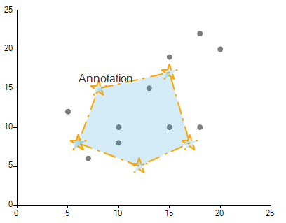

# CartesianFreeFigureAnnotation

**CartesianFreeFigureAnnotation** allows you to add an annotation in **RadChartView** that is formed by a set of **FreeFigurePoints**. This allows you to create a free figure plotted on the view-port. Each **FreeFigurePoint** is defined by **X** and **Y** values. 

>caption Figure 1: CartesianFreeFigureAnnotation



#### Define Annotation

{{source=..\SamplesCS\ChartView\Annotations\CustomAnnotation.cs region=CustomAnnotation}} 
{{source=..\SamplesVB\ChartView\Annotations\CustomAnnotation.vb region=CustomAnnotation}} 

````C#
ScatterSeries scatterSeries = new ScatterSeries();
scatterSeries.Name = "ChartData";
scatterSeries.DataPoints.Add(new ScatterDataPoint(15, 19));
scatterSeries.DataPoints.Add(new ScatterDataPoint(18, 10));
scatterSeries.DataPoints.Add(new ScatterDataPoint(13, 15));
scatterSeries.DataPoints.Add(new ScatterDataPoint(10, 8));
scatterSeries.DataPoints.Add(new ScatterDataPoint(5, 12));
scatterSeries.DataPoints.Add(new ScatterDataPoint(20, 20));
scatterSeries.DataPoints.Add(new ScatterDataPoint(15, 10));
scatterSeries.DataPoints.Add(new ScatterDataPoint(7, 6));
scatterSeries.DataPoints.Add(new ScatterDataPoint(18, 22));
scatterSeries.DataPoints.Add(new ScatterDataPoint(10, 10));
scatterSeries.PointSize = new SizeF(8, 8);
this.radChartView1.Series.Add(scatterSeries);

CartesianFreeFigureAnnotation freeAnnotation = new CartesianFreeFigureAnnotation();
freeAnnotation.Points.Add(new FreeFigurePoint(6, 8));
freeAnnotation.Points.Add(new FreeFigurePoint(8, 15));
freeAnnotation.Points.Add(new FreeFigurePoint(15, 17));
freeAnnotation.Points.Add(new FreeFigurePoint(17, 8));
freeAnnotation.Points.Add(new FreeFigurePoint(12, 5));
freeAnnotation.Points.Add(new FreeFigurePoint(6, 8));

freeAnnotation.CloseFigure = true;
freeAnnotation.Spline = false;
freeAnnotation.Label = "Annotation";
freeAnnotation.Font = new Font("Arial", 12f, FontStyle.Regular);
freeAnnotation.BackColor = Color.FromArgb(50, 37, 160, 219);
freeAnnotation.BorderDashStyle = DashStyle.Custom;
freeAnnotation.BorderDashPattern = new float[] { 9, 3, 2, 4 };
freeAnnotation.BorderColor = Color.Orange;
freeAnnotation.BorderWidth = 2;

freeAnnotation.PointShape = new StarShape();
freeAnnotation.PointSize = new SizeF(24, 24);
this.radChartView1.Annotations.Add(freeAnnotation);


````
````VB.NET
Dim scatterSeries As ScatterSeries = New ScatterSeries()
scatterSeries.Name = "ChartData"
scatterSeries.DataPoints.Add(New ScatterDataPoint(15, 19))
scatterSeries.DataPoints.Add(New ScatterDataPoint(18, 10))
scatterSeries.DataPoints.Add(New ScatterDataPoint(13, 15))
scatterSeries.DataPoints.Add(New ScatterDataPoint(10, 8))
scatterSeries.DataPoints.Add(New ScatterDataPoint(5, 12))
scatterSeries.DataPoints.Add(New ScatterDataPoint(20, 20))
scatterSeries.DataPoints.Add(New ScatterDataPoint(15, 10))
scatterSeries.DataPoints.Add(New ScatterDataPoint(7, 6))
scatterSeries.DataPoints.Add(New ScatterDataPoint(18, 22))
scatterSeries.DataPoints.Add(New ScatterDataPoint(10, 10))
scatterSeries.PointSize = New SizeF(8, 8)
Me.radChartView1.Series.Add(scatterSeries)

Dim freeAnnotation As CartesianFreeFigureAnnotation = New CartesianFreeFigureAnnotation()
freeAnnotation.Points.Add(New FreeFigurePoint(6, 8))
freeAnnotation.Points.Add(New FreeFigurePoint(8, 15))
freeAnnotation.Points.Add(New FreeFigurePoint(15, 17))
freeAnnotation.Points.Add(New FreeFigurePoint(17, 8))
freeAnnotation.Points.Add(New FreeFigurePoint(12, 5))
freeAnnotation.Points.Add(New FreeFigurePoint(6, 8))
freeAnnotation.CloseFigure = True
freeAnnotation.Spline = False
freeAnnotation.Label = "Annotation"
freeAnnotation.Font = New Font("Arial", 12.0F, FontStyle.Regular)
freeAnnotation.BackColor = Color.FromArgb(50, 37, 160, 219)
freeAnnotation.BorderDashStyle = DashStyle.Custom
freeAnnotation.BorderDashPattern = New Single() {9, 3, 2, 4}
freeAnnotation.BorderColor = Color.Orange
freeAnnotation.BorderWidth = 2
freeAnnotation.PointShape = New StarShape()
freeAnnotation.PointSize = New SizeF(24, 24)
Me.radChartView1.Annotations.Add(freeAnnotation)

````

{{endregion}}

## Properties

|Property|Description|
|----|----|
|**Label**|Gets or sets the label.|
|**PointSize**|Gets or sets the point size.|
|**PointShape**|Gets or sets the point shape.|
|**Points**|Gets the collection of data points.|
|**CloseFigure**|Determines whether the figure will be closed by connecting a line from the endpoint to the starting point.|
|**Spline**|Gets or sets a value indicating whether the annotation will be drawn as a spline.|
|**SplineTension**|Gets or sets a value indicating the tension of the spline. Spline property must be set to true for this property to have effect.|
|**PositonOffset**|Allows you to specify the offset for the label.|


# See Also

* [Annotations]()
* [Axes]()
* [Series Types]()
* [Populating with Data]()