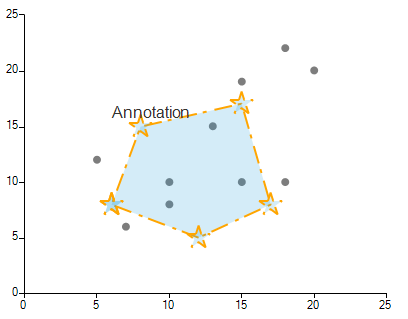

# CartesianFreeFigureAnnotation

**CartesianFreeFigureAnnotation** allows you to add an annotation in **RadChartView** that is formed by a set of **FreeFigurePoints**. This allows you to create a free figure plotted on the view-port. Each **FreeFigurePoint** is defined by **X** and **Y** values. 

>caption Figure 1: CartesianFreeFigureAnnotation

#### Define Annotation

<snippet id='chartview-free-figure-annotation-customannotation-cs'/>
<snippet id='chartview-free-figure-annotation-customannotation-vb'/>

## Properties

|Property|Description|
|----|----|
|**Label**|Gets or sets the label.|
|**PointSize**|Gets or sets the point size.|
|**PointShape**|Gets or sets the point shape.|
|**Points**|Gets the collection of data points.|
|**CloseFigure**|Determines whether the figure will be closed by connecting a line from the endpoint to the starting point.|
|**Spline**|Gets or sets a value indicating whether the annotation will be drawn as a spline.|
|**SplineTension**|Gets or sets a value indicating the tension of the spline. Spline property must be set to true for this property to have effect.|
|**PositonOffset**|Allows you to specify the offset for the label.|

# See Also

* [Annotations]()
* [Axes]()
* [Series Types]()
* [Populating with Data]()
