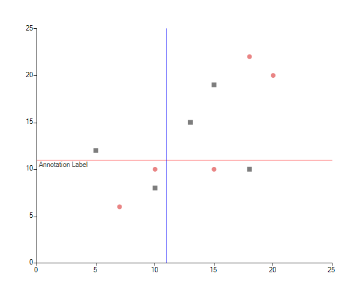
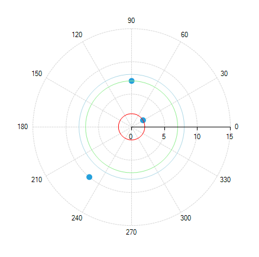
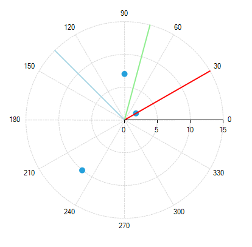

# Grid Line

Grid line annotations are lines or circles that cross the chart grid at location on the axis, specified by their __Value__ property.

Common properties to the three types of annotations include:

* __BorderDashStyle:__ Defines the dash style of the border of the annotation

* __BorderColor:__ Sets the color of the border of the annotation

* __BorderWidth:__ Specifies the width of the border of the annot

## Cartesian Grid Line Annotation

In the case of the Cartesian chart, the grid line represents a vertical or horizontal line that crosses the entire plot area.

Here is what __CartesianGridLineAnnotation__ looks like:

>caption Figure 1: CartesianGridLineAnnotation

#### Cartesian Grid Line Setup

<snippet id='chartview-grid-line-cartesiangridline-cs'/>
<snippet id='chartview-grid-line-cartesiangridline-vb'/>

 
Properties:

* __Axis:__ The Cartesian grid line annotation needs to be associated with horizontal or vertical axis explicitly
            

* __Value__ (of type object): The place on the associated axis where the annotation crosses it. When the associated axis is numerical (linear or logarithmic) a numeric value is expected and when it is a categorical - a category

* __Label:__ This property allows you to display text near the annotation and indicate what it is for.

## Polar Axis Grid Line Annotation

Polar axis grid lines represent concentric circles that cross the Polar axis at the corresponding __Value__.        

Here is what __PolarAxisGridLineAnnotation__ looks like:

>caption Figure 2: PolarAxisGridLineAnnotation

#### Plar Grid Line Setup

<snippet id='chartview-grid-line-polargridline-cs'/>
<snippet id='chartview-grid-line-polargridline-vb'/>

  

Property: 

* __Value__ (of type double): Specifies the location on the Polar axis (the radius), where the grid line will cross

## Radial Axis Grid Line Annotation

Radial axis grid lines basically represent the radius of the polar chart.

Here is what __RadialAxisGridLineAnnotation__ looks like:

>capion Figure 3: RadialAxisGridLineAnnotation

<snippet id='chartview-grid-line-radialgridline-cs'/>
<snippet id='chartview-grid-line-radialgridline-vb'/>

Property:

* __Value__ (of type object): Specifies the location on the Radial axis, where the grid line will cross. When the Radial axis is __NumericRadialAxis__ a numeric value is expected and when it is a __CategoricalRadialAxis__ - a category
            
# See Also

* [Annotations]()
* [Axes]()
* [Series Types]()
* [Populating with Data]()
