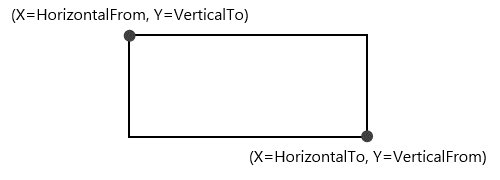
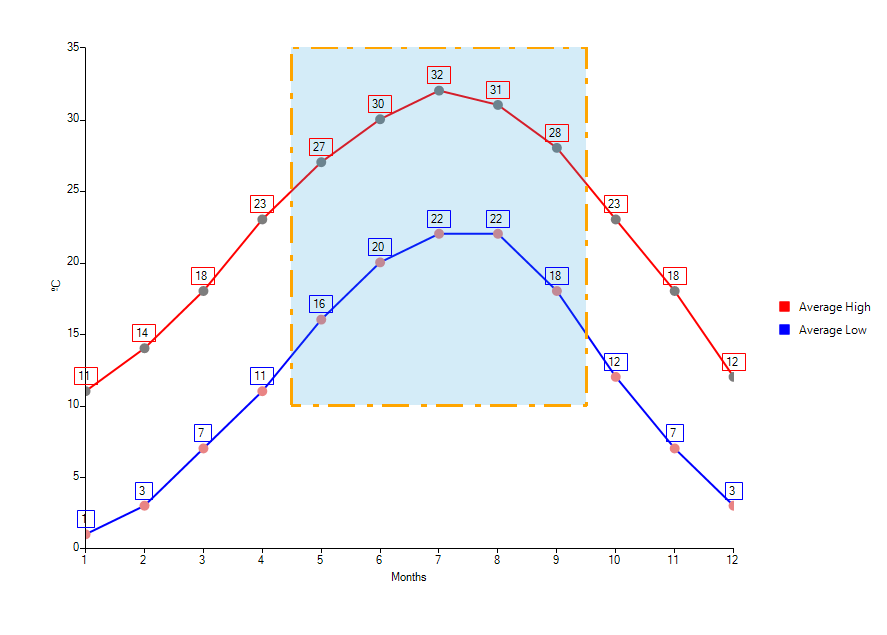
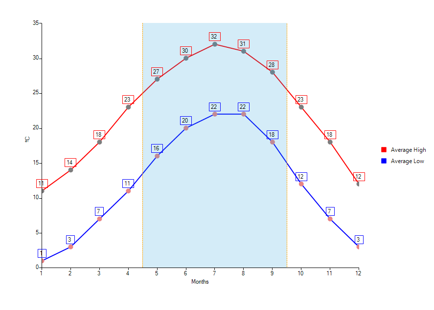
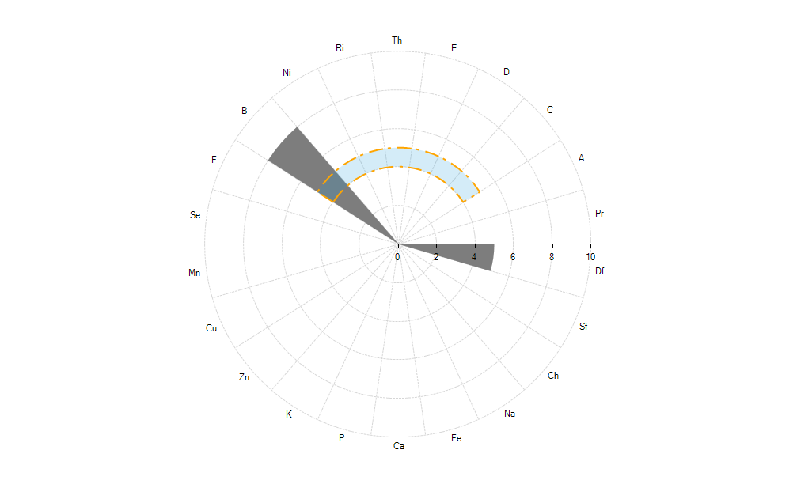
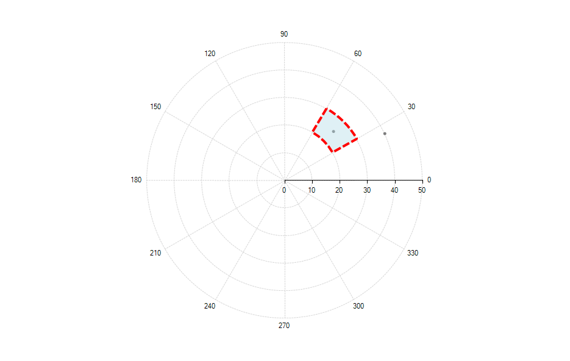

# Marked Zone

The Marked Zone annotation defines a closed figure plotted on the view-port. Its boundaries are set according to properties defining values along two axes of the series. There are two marked zone annotation: **CartesianMarkedZoneAnnotation** and **PolarMarkedZoneAnnotation**.

Common properties to the two types of annotations include:

* **BackColor**: Sets the back color of the annotation.

* **BorderDashStyle**: Defines the dash style of the border of the annotation.

* **BorderDashPattern**: Defines the dash pattern of the border of the annotation.

* **BorderColor**: Sets the color of the border of the annotation.

* **BorderWidth**: Specifies the width of the border of the annotation.

## Cartesian Marked Zone Annotation

The __CartesianMarkedzoneAnnotation__ is a rectangle defined by the __HorizontalFrom/To__ and __VerticalFrom/To__ properties.

>caption Figure 1: Marked Annotation

### Properties

Besides the __HorizontalFrom/To__ and __VerticalFrom/To__ properties that are used for defining the rectangle, the __CartesianMarkedzoneAnnotation__ exposes the following properties:      

* __HorizontalAxis__ and __VerticalAxis:__ Used for associating the annotation with the chart axes.          

* __BackColorL:__  Defines the back color of the marked zone.
          
* __BorderColorL__ Specifies the border color of the marked zone.
          
* __BorderWidth:__ Sets the border width of the marked zone.
          
### Examples

In the following example additional styling is applied to the default look of the annotation.

>caption Figure 2: Annotation With All Bounds Set

#### Define Annotation

<snippet id='chartview-marked-zone-cartesianmarkedzone-cs'/>
<snippet id='chartview-marked-zone-cartesianmarkedzone-vb'/>

The flexible design of the marked zone annotation allows the user to omit one (or more) of the four __HorizontalFrom/To__ and __VerticalFrom/To__ properties. The following table details the relationship between the specified properties and the occupied interval on the axis:

|  __Specified Properties__  |  __Occupied interval__  |
| ------ | ------ |
| __Both From and To__ |[Min(From,To), Max(From,To)]|
| __Only From__ |[From,+∞]|
| __Only To__ |[-∞, To]|

Here is the previous example with some of the settings commented

#### Horizontally Defined Marked Zone

<snippet id='chartview-marked-zone-cartesianmarkedzone2-cs'/>
<snippet id='chartview-marked-zone-cartesianmarkedzone2-vb'/>

 

>caption Figure 3: Horizontally Defined Marked Zone

## Polar Marked Zone Annotation

The **PolarMarkedZoneAnnotation** defines a pie arc segment painted on a *Polar* area. This annotation is compatible for series using a *Polar* coordinate system: **RadarColumnSeries**, **RadarPointSeries**, and **PolarPointSeries**.

>caption Figure 4: Polar Marked Zone Annotation in Combination with a RadarColumnSeries

### Properties

Four properties need to be set for a polar marked zone annotation.      

* **PolarFrom**: Gets or sets the starting point on the Polar axis.         

* **PolarTo**:  Gets or sets the ending point on the Polar axis.
          
* **RadialFrom**: Gets or sets the starting point on the Radial axis.
          
* **RadialTo**: Gets or sets the ending point on the Radial axis.

>note The values set to the **RadialFrom** and **RadialTo** properties need to correspond to the type of the series. In the case of Radar series, one needs to use categories as values and in the case of a Polar series one needs to use angles.  

### Example

The example below adds a **PolarMarkedZoneAnnotation** to a **PolarPointSeries**.

>caption Figure 5: PolarPointSeries and Markzed Zone

#### Polar Marked Zone Settings

<snippet id='chartview-marked-zone-polarmarkedzone-cs'/>
<snippet id='chartview-marked-zone-polarmarkedzone-vb'/>

 

# See Also

* [Annotations]()
* [Axes]()
* [Series Types]()
* [Populating with Data]()
