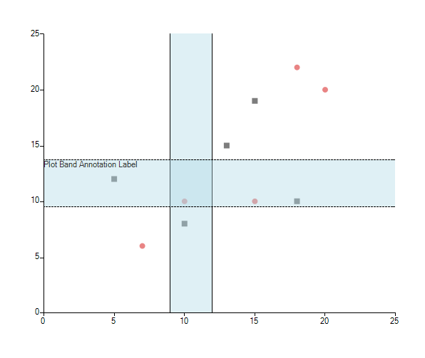
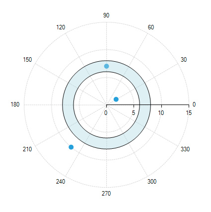
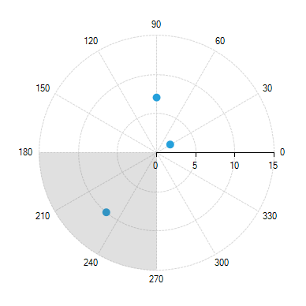
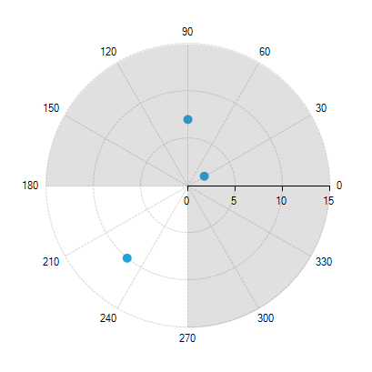

# Plot Band

Plot band annotation is a stripe, crossing its corresponding axis, specified by the __From__ and __To__ properties.

Common properties to the three types of annotations include:

* __BackColor:__ Sets the back color of the annotation.

* __BorderDashStyle:__ Defines the dash style of the border of the annotation.

* __BorderColor:__ Sets the color of the border of the annotation.

* __BorderWidth:__ Specifies the width of the border of the annotation.

## Cartesian Plot Band Annotation

Cartesian plot band annotation is either a horizontal or a vertical stripe that crosses from start to end the vertical or the horizontal axis respectively.

Here is what __CartesianPlotBandAnnotation__ looks like:

>caption Figure 1: CartesianPlotBandAnnotation

#### Plot Band Annotation Setup

<snippet id='chartview-plot-band-cartesianplotband-cs'/>
<snippet id='chartview-plot-band-cartesianplotband-vb'/>

Properties:

* __Axis:__ The Cartesian plotBand annotation needs to be associated with horizontal or vertical axis explicitly.

* __From__ (of type object): The starting point for the plot band. When the associated axis is numerical (Linear or Logarithmic) a numeric value is expected and when it is a  __CategoricalAxis__ - a category.

* __To__ (of type object): The ending point for the plot band. When the associated axis is numerical (Linear or Logarithmic) a numeric value is expected and when it is a __CategoricalAxis__ - a category.

* __Label:__ This property allows you to display text near the annotation and indicate what it is for.

## Polar Axis Plot Band Annotation

The Polar axis plot band annotation resembles a donut.

Here is what __PolarAxisPlotBandAnnotation__ looks like:

>caption Figure 2: PolarAxisPlotBandAnnotation

#### Polar Axis Annotation

<snippet id='chartview-plot-band-polarplotband-cs'/>
<snippet id='chartview-plot-band-polarplotband-vb'/>

Properties:

* __From__ (of type double): The starting point for the plot band.

* __To__ (of type double): The ending point for the plot band.

## Radial Axis Plot Band Annotation

Radial axis plot band annotations represent visually a sector of the circle (pie slice).

A plot band starting from *180* degrees and ending in *270* degrees will look like this:

>caption Figure 3: RadialAxisPlotBandAnnotation

#### Radial Axis Annotations

<snippet id='chartview-plot-band-radialplotband1-cs'/>
<snippet id='chartview-plot-band-radialplotband1-vb'/>

If you wonder how to annotate the bigger segment from the image above, then you should use the __From__ and __To__ values.

>caption Figure 3: Annotated Bigger Segment

#### Define Bigger Segment

<snippet id='chartview-plot-band-radialplotband2-cs'/>
<snippet id='chartview-plot-band-radialplotband2-vb'/>

 

Properties:

* __From__ (of type object): The starting point for the plot band. When the Radial axis is __NumericRadialAxis__ a numeric value is expected and when it is a __CategoricalRadialAxis__ - a category.

* __To__ (of type object): Tthe ending point for the plot band. When the Radial axis is __NumericRadialAxis__ a numeric value is expected and when it is a __CategoricalRadialAxis__ - a category.

# See Also

* [Annotations]()
* [Axes]()
* [Series Types]()
* [Populating with Data]()
