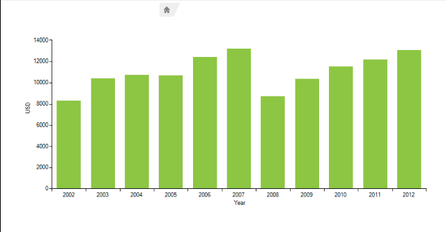

# Drill down

The drill down functionality of a chart allows users to click on a graphical element (bar, pie segment etc.), representing some data, in order to navigate to another view which contains different data than the first one. The new view usually contains finer grained data like displaying information from yearly to quarterly data, from quarterly to monthly, etc., or in the case of a retail store from categories to brands, from brands to items, etc. The drill-down functionality basically makes your data points act like a hotspots for “drilling-down” or “zooming” into your data. 

The animation below demonstrates how from BarSeries showing sales for 10 years as bars, when a bar is clicked you are navigated to another view showing BarSeries again, but this time displaying the sales for all months in the selected year. Clicking a month bar will produce another view, which displays line series with data for each day of the month.

>caption Figure 1: Drill Down Functionality

To support this functionality a __DrillDownControler__ should be used: 

#### Add Controller

<snippet id='chartview-drill-down-drillcontroler-cs'/>
<snippet id='chartview-drill-down-drillcontroler-vb'/>

Then, you will need to add as many __ChartViews__ as you need. Each __ChartView__ represents different level of the drill operation. 

#### Add Views

<snippet id='chartview-drill-down-addnewview-cs'/>
<snippet id='chartview-drill-down-addnewview-vb'/>

>important In order to show the added __ChartViews__ you should set the __ShowDrillNavigation__ property to *true*.
>

To handle the different levels, the __Drill__ event should be used. Depending on the __Level__ provided in the event arguments, you can decide how to setup the View. In the example below, different data is represented for Years, Months and Days: 

#### Drill Event

<snippet id='chartview-drill-down-drillevent-cs'/>
<snippet id='chartview-drill-down-drillevent-vb'/>

>important If your chart is being oriented horizontally, please make sure that in the **Drill** event you are setting the correct axes as **First** and **Second**. In the example above, for a horizontally oriented view, the horizontal axis should be set as **Second** and the vertical axis should be set as **First**. 
>

>note The navigation element’s text is taken from __TitleElement.Text__ property by default, so every time you drill, you have to change this text accordingly. If this text is empty, it will be taken from the __RadChartView.View.ViewName__ property.
>

To make the example complete you should make few more steps:

1\. First you should create __DrillDownDataInfo__ class which will contain two properties __Value__ and __Date__ and will implement the __INotifyPropertyChanged__ interface: 

#### Data Object

<snippet id='chartview-drill-down-drilldowndatainfo-cs'/>
<snippet id='chartview-drill-down-drilldowndatainfo-vb'/>

 

2\. Now you can use this class to create three binding lists. Each one will contain data for the chart view. These methods are used in the previously described Drill event handler. 

#### Load Data

<snippet id='chartview-drill-down-loaddata-cs'/>
<snippet id='chartview-drill-down-loaddata-vb'/>

 
 
>note Note that the data is loaded from external files. These files contain dates and values which are parsed and stored in out DrillDownDataInfo class objects. The files are included in __Telerik UI for WinForms__ suite (navigate to *Telerik\UI for WinForms Q3 2013\Examples\QuickStart\Resources* ).
>

3\. Finally you should initialize the chart by adding a series to it. Also the corresponding axes should be added. 

#### Add Series

<snippet id='chartview-drill-down-databyyears-cs'/>
<snippet id='chartview-drill-down-databyyears-vb'/>

 

 
Now you can examine how this functionality works by clicking a data point in the chart. You can use the additional buttons to drill up or drill to top.

# See Also

* [Axes]()
* [Series Types]()
* [Populating with Data]()
* [Customization]()
* [Printing]()
