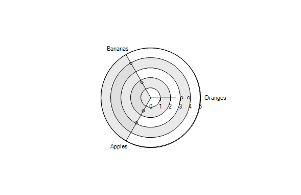

# Export

__RadChartView__ supports export to image functionality.

You can export the __RadChartVew__ content by using one of the following overloads of the __ExportToImage__ method:
      
* __ExportToImage(Stream stream, Size size)__

* __ExportToImage(Stream stream, Size size, ImageFormat imageFormat)__

* __ExportToImage(string filePath, Size size)__

* __ExportToImage(string filePath, Size size, ImageFormat imageFormat)__ 

#### Export to Image

{{source=..\SamplesCS\ChartView\ChartViewExport.cs region=ExportToImage}} 
{{source=..\SamplesVB\ChartView\ChartViewExport.vb region=ExportToImage}} 

````C#
            
string filePath = @"..\..\..\exprtedChart.png";
this.radChartView1.ExportToImage(filePath, this.radChartView1.Size, System.Drawing.Imaging.ImageFormat.Png);

````
````VB.NET
Dim filePath As String = "..\..\..\exprtedChart.png"
Me.RadChartView1.ExportToImage(filePath, Me.RadChartView1.Size, System.Drawing.Imaging.ImageFormat.Png)

````

{{endregion}} 

>caption Figure 1: Exported Chart


>note If you need to export the chart data to a document, you can use a __RadDocument__ and [insert the exported image]() into it. Afterwards, you can use the __RadRichTextEditor__ 's[ export]() functionality.
>

# See Also

* [Axes]()
* [Series Types]()
* [Populating with Data]()
* [Customization]()
* [Printing]()
