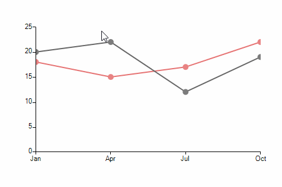
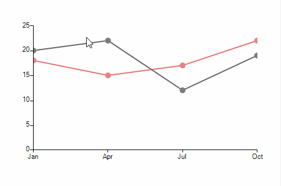

# Lasso Selection

**RadChartView** provides lasso selection functionality allowing data points to be selected upon creating a lasso rectangle with the mouse. The functionality is defined in the **LassoSelectionController** class and it is only supported in the *Cartesian Area*.

>caption Figure 1: Selecting Data Points

#### Add Sample Data and a Controller

<snippet id='chartview-lasso-selection-setuplassoselection-cs'/>
<snippet id='chartview-lasso-selection-setuplassoselection-vb'/>

The **LassoSelectionController** exposes a **LassoSelectedPointsChanged** event providing access to the data points within the bounds of the selection rectangle. In a scenario with multiple series, each of the series can be extracted from the **Presenter** property of the data point object   

#### The LassoSelectedPointsChanged Event

<snippet id='chartview-lasso-selection-lassoselectedpointschangedevent-cs'/>
<snippet id='chartview-lasso-selection-lassoselectedpointschangedevent-vb'/>

>note The controllers added in **RadChartView** are invoked in the order at which they have been added. In case a **LassoZoomController** is to be used together with a **LassoSelectionController**, the selection controller needs to be added first. 

>caption Figure 2: Lasso and Zoom

#### Lasso and Zoom Selection Controllers

<snippet id='chartview-lasso-selection-setuplassozoomcontrollers-cs'/>
<snippet id='chartview-lasso-selection-setuplassozoomcontrollers-vb'/>

Using this approach you can zoom any area in the chart using the 0-100 percentage scale.

# See Also

* [Axes]()
* [Series Types]()
* [Populating with Data]()
* [Customization]()
* [Printing]()
* [Integrating PanZoom, TrackBall and LassoZoom Controllers in RadChartView](http://www.telerik.com/support/kb/winforms/details/integrating-panzoom-trackball-and-lassozoom-controllers-in-radchartview)
