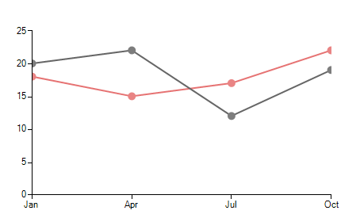
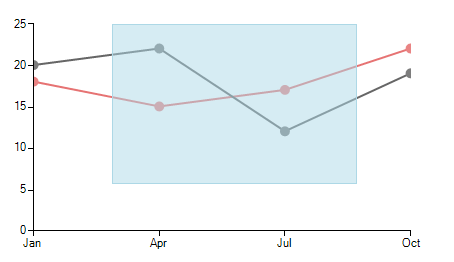
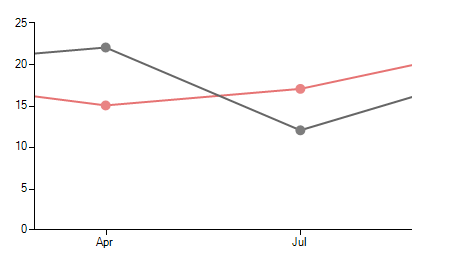
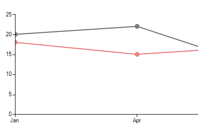

# Lasso Zoom

__RadChartView__ provides lasso zoom (zoom to selection) functionality by selecting a rectangle on the surface of the control and then zoom in automatically based on the selected *Cartesian area*.

First let’s start by adding some data points to the __RadChartView__ and __LassoZoomController__: 

#### Add Controller

<snippet id='chartview-lasso-zoom-addcontroller-cs'/>
<snippet id='chartview-lasso-zoom-addcontroller-vb'/>

 

>caption Figure 1: Initial Chart

Now, let’s select some area:

>caption Figure 2: Lasso Selection

And the chart will automatically zoom to the selected area:

>caption Figure 3: Zoom to Selection

__LassoZoomController__ supports zoom and pan functionality programmatically via the *ZoomAndPan*  method, which allows specifying the exact *from* and *to* percentage. The following code will zoom the first half of the chart: 

#### Zoom and Pan

<snippet id='chartview-lasso-zoom-zoomfirst-cs'/>
<snippet id='chartview-lasso-zoom-zoomfirst-vb'/>

 

>caption Figure 4: Zoom and Pan

Using this approach you can zoom any area in the chart using the 0-100 percentage scale.

>note The controllers added in **RadChartView** are invoked in the order at which they have been added. In case a **LassoZoomController** is to be used together with a **LassoSelectionController**, the selection controller needs to be added first. 

# See Also

* [Axes]()
* [Series Types]()
* [Populating with Data]()
* [Customization]()
* [Printing]()
* [Integrating PanZoom, TrackBall and LassoZoom Controllers in RadChartView](http://www.telerik.com/support/kb/winforms/details/integrating-panzoom-trackball-and-lassozoom-controllers-in-radchartview)
