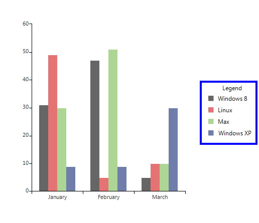
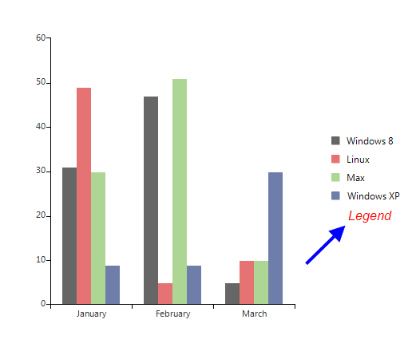
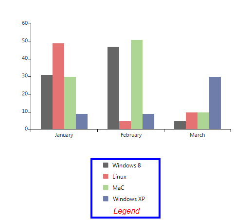
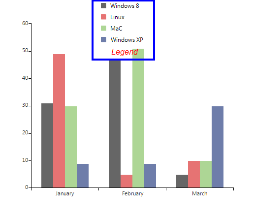
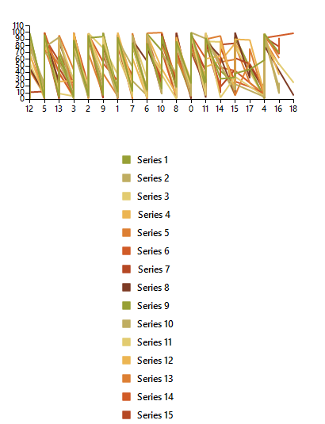
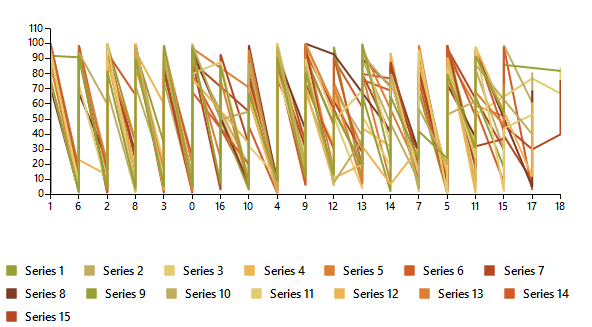
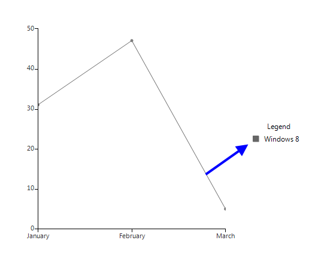
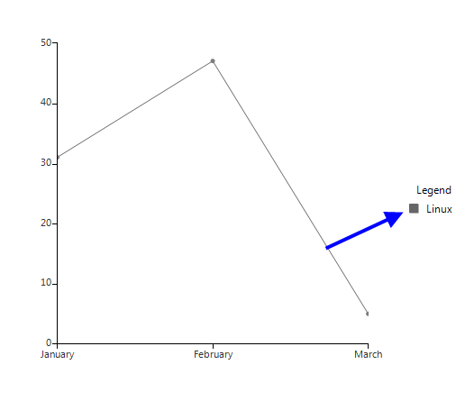
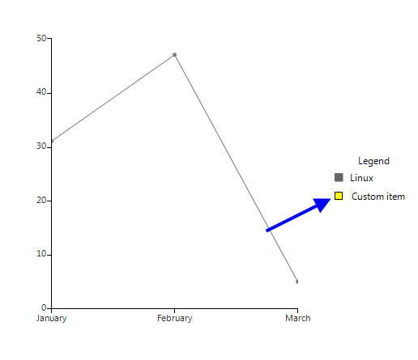
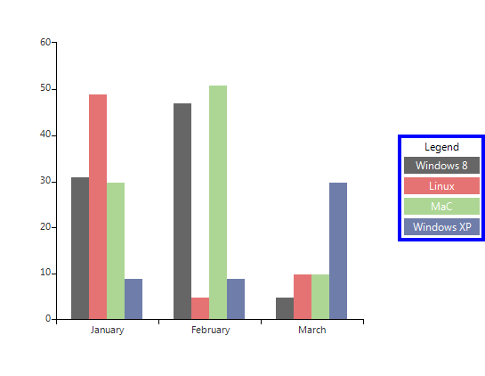

# Legend

__RadChartView__ has built-in support for legends – descriptions about the charts on the plot. The items displayed in the legend are series specific i.e. for the pie chart the data points are shown in the legend, whereas for line series only one item is shown for each series. 

## Show Legend

The __ShowLegend__ property of __RadChartView__ controls whether the legend is visible or not. The default value is *false*. The legend supports showing a legend title, which text can be set via the __LegendTitle__ property. 

#### Show Legend

<snippet id='chartview-legend-showlegend-cs'/>
<snippet id='chartview-legend-showlegend-vb'/>

>caption Figure 1: Show Legend

##  Customize legend

The location of the title can be modified by the __TitlePosition__ property. Additional modification of the title can be introduced by using the __TitleElement__: 

#### Legend Settings

<snippet id='chartview-legend-customizelegendtitle-cs'/>
<snippet id='chartview-legend-customizelegendtitle-vb'/>

>caption Figure 2: Legend Settings

You can dock the legend to each of the four sides of the control by setting the __LegendPosition__ property.

#### Legend Position

<snippet id='chartview-legend-legendpositionbottom-cs'/>
<snippet id='chartview-legend-legendpositionbottom-vb'/>

>caption Figure 3: Legend Position 

Alternatively, you can set it to float over the chart view. Here is how to set the legend to stay at position  *200 , 0* over the chart area.

>note The __LegendOffset__ property is only taken into consideration when the __LegendPosition__ is set to *“Float”*.
> 

#### Float Legend

<snippet id='chartview-legend-legendpositionfloat-cs'/>
<snippet id='chartview-legend-legendpositionfloat-vb'/>

>caption Figure 4: Float Legend

>note As of **R3 2022 SP2** RadChartView supports wrapping for its legend items. It is controlled by the ChartElement.**LegendItemsLayout** property. The available options are: **Stack** - the items are positioned in rows or columns(horizontally or vertically) and if necessary a scrollbar is shown. **Wrap** - the items are positioned in rows or columns, based on the orientation property. When the space is filled, the container automatically wraps items onto a new row or column. 

#### Wrap Legend Items

<snippet id='chartview-legend-wraplegend-cs'/>
<snippet id='chartview-legend-wraplegend-vb'/>

|LegendItemsLayout.Stack|LegendItemsLayout.Wrap|
|----|----|
|||

## Setup LegendItem

The elements that provide legend items in the case of the Pie chart are the individual data points. In all other cases it is the series that provide legend items. You can set two properties to each provider which controls their representation in the legend. These two properties are __IsVisibleInLegend__ and __LegendTitle__. 

#### Legend Properties

<snippet id='chartview-legend-legendproperties-cs'/>
<snippet id='chartview-legend-legendproperties-vb'/>

>caption Figure 5: Legend Properties

## Modify LegendItem title

You have access to the items displayed in the legend through the __Items__ property of the chart legend. This collection gives you access to the actual legend items that the provider creates. This means that if you change the text in the legend item, the text in the provider (data point or series), will also change. Let’s say you have added the line series from the previous example to the chart and you change the title of the legend item through the legend’s __Items__ collection with the following code, this will actually change the value in the series legend item: 

#### Change Text

<snippet id='chartview-legend-changelegenditemtext-cs'/>
<snippet id='chartview-legend-changelegenditemtext-vb'/>

>caption Figure 6: Changed Text

## Add/Remove LegendItems

You can add and remove items from the legend through the __Items__ collection. You have to create a new instance of __LegendItem__ which you will add to the __Items__ collection. You can set the desired style of the marker through the __Element__ property of the __LegendItem__. 

#### Add and Remove Legends

<snippet id='chartview-legend-addlegenditem-cs'/>
<snippet id='chartview-legend-addlegenditem-vb'/>

>caption Figure 7: Added Item

## Custom Legend Item

You can use your own legend item elements by handling the __VisualItemCreating__ event of the legend. This allows you to change the way legend items are represented in the legend:  

#### Add a Custom Legend Item

<snippet id='chartview-legend-customlegenditem1-cs'/>
<snippet id='chartview-legend-customlegenditem1-vb'/>

#### Custom LegendItemElement Implementation:

<snippet id='chartview-legend-customlegenditem2-cs'/>
<snippet id='chartview-legend-customlegenditem2-vb'/>

>caption Figure 8: Custom Legend Item

# See Also

* [Axes]()
* [Series Types]()
* [Populating with Data]()
* [Customization]()
* [Printing]()
