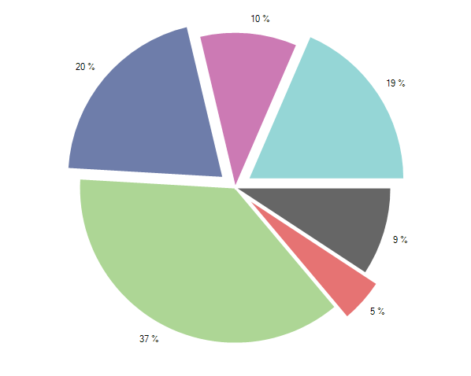

# Selection

This help topic will demonstrate how you can make your charts more interactive by adding a selection behavior.        

In order to utilize this behavior users simply have to add it to the chart's __Controllers__ collection. For example:

#### Add Controller

{{source=..\SamplesCS\ChartView\Features\ChartSelection.cs region=controller}} 
{{source=..\SamplesVB\ChartView\Features\ChartSelection.vb region=controller}} 

````C#
radChartView1.Controllers.Add(new ChartSelectionController());
radChartView1.SelectionMode = ChartSelectionMode.SingleDataPoint;
radChartView1.SelectedPointChanged += new ChartViewSelectedChangedEventHandler(radChartView1_SelectedPointChanged);

````
````VB.NET
RadChartView1.Controllers.Add(New ChartSelectionController())
RadChartView1.SelectionMode = ChartSelectionMode.SingleDataPoint
AddHandler RadChartView1.SelectedPointChanged, AddressOf RadChartView1_SelectedPointChanged

````

{{endregion}}

The __ChartSelectionController__ will be added automatically if the __SelectionMode__ property of __RadChartView__ control is set to one of available options. 

#### ChartSelectionMode

{{source=..\SamplesCS\ChartView\Features\ChartSelection.cs region=selectionMode}} 
{{source=..\SamplesVB\ChartView\Features\ChartSelection.vb region=selectionMode}} 

````C#
radChartView1.SelectionMode = ChartSelectionMode.SingleDataPoint;
radChartView1.SelectionMode = ChartSelectionMode.MultipleDataPoints;

````
````VB.NET
radChartView1.SelectionMode = ChartSelectionMode.SingleDataPoint
radChartView1.SelectionMode = ChartSelectionMode.MultipleDataPoints

````

{{endregion}}  

Here is a sample using __PieSeries__ and multiple selection. When a slice is selected, it is being offsetted from the center: 

#### Sliced Pie

{{source=..\SamplesCS\ChartView\Features\ChartSelection.cs region=example}} 
{{source=..\SamplesVB\ChartView\Features\ChartSelection.vb region=example}} 

````C#
public ChartSelection()
{
    InitializeComponent();
    radChartView1.AreaType = ChartAreaType.Pie;
    PieSeries pieSeries = new PieSeries();
    pieSeries.ShowLabels = true;
    pieSeries.PointSize = new SizeF(15, 15);
    pieSeries.DataPoints.Add(new PieDataPoint(10));
    pieSeries.DataPoints.Add(new PieDataPoint(5));
    pieSeries.DataPoints.Add(new PieDataPoint(40));
    pieSeries.DataPoints.Add(new PieDataPoint(22));
    pieSeries.DataPoints.Add(new PieDataPoint(11));
    pieSeries.DataPoints.Add(new PieDataPoint(20));
    radChartView1.Series.Add(pieSeries);
    radChartView1.Controllers.Add(new ChartSelectionController());
    radChartView1.SelectionMode = ChartSelectionMode.MultipleDataPoints;
    radChartView1.SelectedPointChanged += new ChartViewSelectedChangedEventHandler(radChartView1_SelectedPointChanged);
}
void radChartView1_SelectedPointChanged(object sender, ChartViewSelectedPointChangedEventArgs args)
{
    if (args.NewSelectedPoint != null)
    {
        UpdateSelectedPoint(args.NewSelectedPoint);
    }
    if (args.OldSelectedPoint != null)
    {
        UpdateSelectedPoint(args.OldSelectedPoint);
    }
}
void UpdateSelectedPoint(DataPoint point)
{
    PieDataPoint pieDataPoint = point as PieDataPoint;
    if (pieDataPoint != null)
    {
        if (pieDataPoint.IsSelected)
        {
            pieDataPoint.OffsetFromCenter = 0.1;
        }
        else
        {
            pieDataPoint.OffsetFromCenter = 0;
        }
    }
}

````
````VB.NET
Public Sub New()
    InitializeComponent()
    radChartView1.AreaType = ChartAreaType.Pie
    Dim pieSeries As New PieSeries()
    pieSeries.ShowLabels = True
    pieSeries.PointSize = New SizeF(15, 15)
    pieSeries.DataPoints.Add(New PieDataPoint(10))
    pieSeries.DataPoints.Add(New PieDataPoint(5))
    pieSeries.DataPoints.Add(New PieDataPoint(40))
    pieSeries.DataPoints.Add(New PieDataPoint(22))
    pieSeries.DataPoints.Add(New PieDataPoint(11))
    pieSeries.DataPoints.Add(New PieDataPoint(20))
    radChartView1.Series.Add(pieSeries)
    RadChartView1.Controllers.Add(New ChartSelectionController())
    RadChartView1.SelectionMode = ChartSelectionMode.MultipleDataPoints
    AddHandler RadChartView1.SelectedPointChanged, AddressOf RadChartView1_SelectedPointChanged
End Sub
Private Sub RadChartView1_SelectedPointChanged(sender As Object, args As ChartViewSelectedPointChangedEventArgs)
    If args.NewSelectedPoint IsNot Nothing Then
        UpdateSelectedPoint(args.NewSelectedPoint)
    End If
    If args.OldSelectedPoint IsNot Nothing Then
        UpdateSelectedPoint(args.OldSelectedPoint)
    End If
End Sub
Private Sub UpdateSelectedPoint(point As DataPoint)
    Dim pieDataPoint As PieDataPoint = TryCast(point, PieDataPoint)
    If pieDataPoint IsNot Nothing Then
        If pieDataPoint.IsSelected Then
            pieDataPoint.OffsetFromCenter = 0.1
        Else
            pieDataPoint.OffsetFromCenter = 0
        End If
    End If
End Sub

````

{{endregion}}

>caption Figure 2: Sliced Pie


# See Also

* [Axes]()
* [Series Types]()
* [Populating with Data]()
* [Customization]()
* [Printing]()
