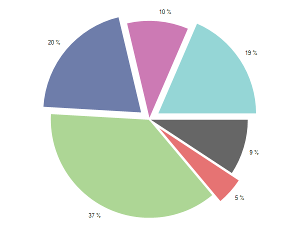

# Selection

This help topic will demonstrate how you can make your charts more interactive by adding a selection behavior.        

In order to utilize this behavior users simply have to add it to the chart's __Controllers__ collection. For example:

#### Add Controller

<snippet id='chartview-selection-controller-cs'/>
<snippet id='chartview-selection-controller-vb'/>

The __ChartSelectionController__ will be added automatically if the __SelectionMode__ property of __RadChartView__ control is set to one of available options. 

#### ChartSelectionMode

<snippet id='chartview-selection-selectionmode-cs'/>
<snippet id='chartview-selection-selectionmode-vb'/>

Here is a sample using __PieSeries__ and multiple selection. When a slice is selected, it is being offsetted from the center: 

#### Sliced Pie

<snippet id='chartview-selection-example-cs'/>
<snippet id='chartview-selection-example-vb'/>

>caption Figure 2: Sliced Pie

# See Also

* [Axes]()
* [Series Types]()
* [Populating with Data]()
* [Customization]()
* [Printing]()
