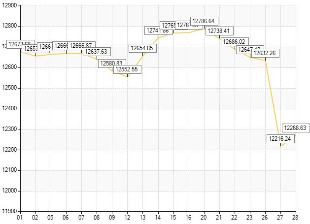
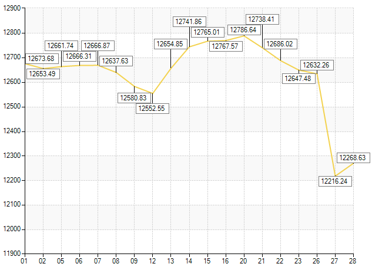
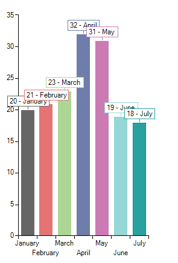
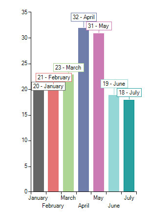
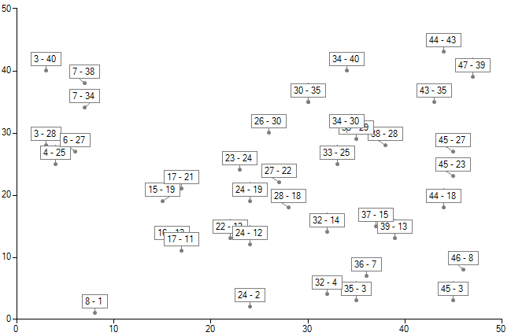
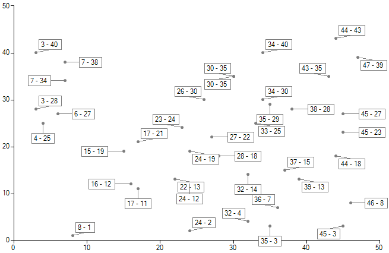
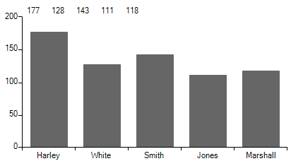
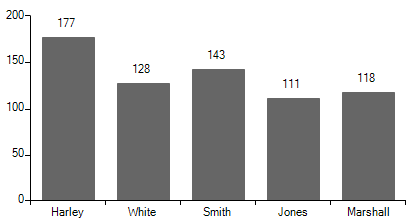

# Smart labels

__RadChartView__ provides a built-in mechanism for resolving labels overlapping with the __SmartLabelsController__. You can add the controller to the __Controllers__ collection of __RadChartView__ and it will optimize the arrangement of the labels in a way that there will be less overlaps.

#### Add Controller

<snippet id='chartview-smart-labels-addsmartlabelscontroller-cs'/>
<snippet id='chartview-smart-labels-addsmartlabelscontroller-vb'/>

Alternatively, you can leave __RadChartView__ do this for you by setting the __ShowSmartLabels__ property: 

#### Set Property

<snippet id='chartview-smart-labels-enablesmartlabels-cs'/>
<snippet id='chartview-smart-labels-enablesmartlabels-vb'/>

 
Automatic label placement is one the most complex and time consuming operations in a chart that is NP-hard ([http://en.wikipedia.org/wiki/NP-Hard](http://en.wikipedia.org/wiki/NP-Hard)). There is no universal solution for all chart types and there is no solution that can guarantee solution for 100% of the label collisions in every case.

>caption Figure 1: Without Smart Labels

>caption Figure 2: With Smart Labels

__RadChartView__’s __SmartLabelsController__ uses strategies specific to different chart types to resolve label overlaps. Since label overlapping can be quite time consuming with more generalized methods, the more concrete a strategy is the better the performance that can be expected out of it. You do not need to be concerned with the strategy, __RadChartView__ will choose the best of the built-in strategies to be used in your chart.

>caption Figure 3: Without Smart Labels

>caption Figure 4: With Smart Labels

>caption Figure 5: Without Smart Labels

>caption Figure 6: With Smart Labels

# Custom labels strategy

In a specific scenario you may need to control the labels' position. For this purpose, create a derivative of the __SmartLabelsStrategyBase__ class and override its __CalculateLocations__ method. Then, you should use this custom logic in the __SmartLabelsController__. You can find below a sample code snippet demonstrating how you can position the labels in the top part of the chart:

#### Custom SmartLabelsStrategy 

<snippet id='chartview-smart-labels-customsmartlabelsstrategy-cs'/>
<snippet id='chartview-smart-labels-customsmartlabelsstrategy-vb'/>

You must apply the custom __SmartLabelsController__ to __RadChartView__:

#### Apply custom strategy

<snippet id='chartview-smart-labels-applycustomstrategy-cs'/>
<snippet id='chartview-smart-labels-applycustomstrategy-vb'/>

After the **R3 2018 SP1** release, the custom strategy can be applied after setting the Strategy property of the control and after regsitering it with all compatible series: 

<snippet id='chartview-smart-labels-applycustomstrategyproperty-cs'/>
<snippet id='chartview-smart-labels-applycustomstrategyproperty-vb'/>

|Before|After|
|----|----|
|||

# See Also

* [Axes]()
* [Series Types]()
* [Populating with Data]()
* [Customization]()
* [Printing]()
* [Tips and Tricks to Optimize RadChartView's Performance]()
