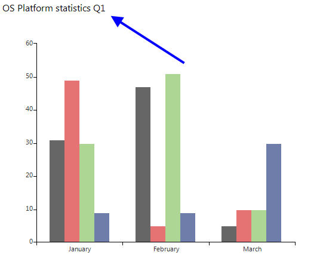
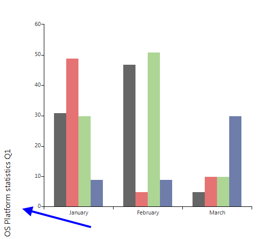

# Title

To show the title in __RadChartView__ you need to set the __ShowTitle__ property to *true* (by default is *false*) and also to set the desired title text in the __Title__ property: 

#### Showing Title

<snippet id='chartview-title-showtitle-cs'/>
<snippet id='chartview-title-showtitle-vb'/>

>caption Figure 1: Custom Title

The title can be moved to all four sides of the chart using the __TitleLocation__ property. Also, you can access the title element, which allows you to set various options: 

<snippet id='chartview-title-customizetitle-cs'/>
<snippet id='chartview-title-customizetitle-vb'/>

>caption Figure 2: Title Positon

# See Also

* [Axes]()
* [Series Types]()
* [Populating with Data]()
* [Customization]()
* [Printing]()
