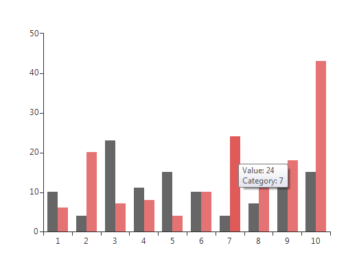
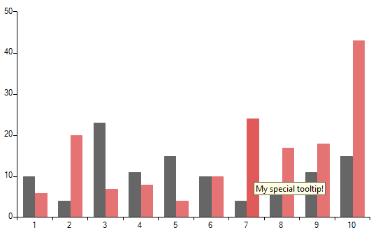

# Tooltip

__RadChartView__ provides a tooltip interactivity  with the __ChartTooltipController__ class and can be used to visualize arbitrary information related to a data point. If the user hovers directly over a data point, the tooltip will display information for this particular data point, otherwise it will display information for the closest data point to the hold location.In order to utilize this behavior users simply have to add it to the chart's __Controllers__ collection. For example: 

#### Add Controller

<snippet id='chartview-tooltip-controller-cs'/>
<snippet id='chartview-tooltip-controller-vb'/>

The __ChartTooltipController__ will be added automatically if the __ShowToolTip__ property of __RadChartView__ control is set to *true*: 

#### Set Property

<snippet id='chartview-tooltip-showtooltip-cs'/>
<snippet id='chartview-tooltip-showtooltip-vb'/>

A sample is shown below: 

#### Sample Setup

<snippet id='chartview-tooltip-example-cs'/>
<snippet id='chartview-tooltip-example-vb'/>

>caption Figure 1: ToolTip

The __ChartTooltipController__ also exposes a tooltip event. The event handler is a suitable place for changing the precalculated text.

#### Subscribe to Event

<snippet id='chartview-tooltip-datapointtooltiptextneeded-cs'/>
<snippet id='chartview-tooltip-datapointtooltiptextneeded-vb'/>

#### Change ToolTip`s Text

<snippet id='chartview-tooltip-changetext-cs'/>
<snippet id='chartview-tooltip-changetext-vb'/>

>caption Figure 2: Modified ToolTip

# See Also

* [Axes]()
* [Series Types]()
* [Populating with Data]()
* [Customization]()
* [Printing]()
