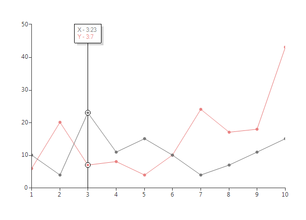
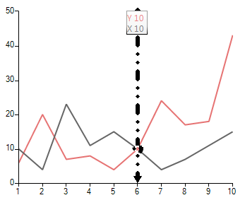

# Trackball

Along with tooltip and pan/zoom controllers, __RadChartView__ provides a trackball behavior through the __ChartTrackballController__ class. This controller can display a vertical line across the chart plot area and also to display little visual indicators (circles by default) at points where the trackball line crosses the visualization of a series object. For example when the trackball line crosses a line series line segment, a small circle is drawn highlighting the value of the series at this point. The last capability of the trackball behavior is to display a small popup, similar to the tooltip, in order to provide more detailed information about the closest points to the track ball line's cross section.    

In order to utilize this behavior users simply have to add it to the chart's __Controllers__ collection. For example:

#### Add Controller

<snippet id='chartview-trackball-controller-cs'/>
<snippet id='chartview-trackball-controller-vb'/>


The __ChartTrackballController__ will be added automatically if the __ShowTrackBall__ property of __RadChartView__ control is set to *true*: 

#### Set Property

<snippet id='chartview-trackball-showtrackball-cs'/>
<snippet id='chartview-trackball-showtrackball-vb'/>


A sample is shown below:

#### Sample Setup

<snippet id='chartview-trackball-example-cs'/>
<snippet id='chartview-trackball-example-vb'/>


>caption Figure 1: Trackball


## Customizing the Trackball

**RadChartView** provides a convenient way to control how the trackball is rendered. You can handle the **PenInitialized** event and customize the **Pen** object as follows:


````C#

            ChartTrackballController trackballController = new ChartTrackballController();
            trackballController.PenInitialized += trackballController_PenInitialized;
            radChartView1.Controllers.Add(trackballController);


        private void trackballController_PenInitialized(object sender, PenInitializedEventArgs e)
        {
            e.Pen.Width = 6;
            e.Pen.DashCap = System.Drawing.Drawing2D.DashCap.Triangle;
            e.Pen.DashStyle = System.Drawing.Drawing2D.DashStyle.DashDotDot;
            e.Pen.DashOffset = 50;
            e.Pen.StartCap = System.Drawing.Drawing2D.LineCap.DiamondAnchor;
            e.Pen.EndCap = System.Drawing.Drawing2D.LineCap.ArrowAnchor;
        }


````
````VB.NET

        Dim trackballController As ChartTrackballController = New ChartTrackballController()
        AddHandler trackballController.PenInitialized, AddressOf trackballController_PenInitialized
        radChartView1.Controllers.Add(trackballController)


    Private Sub trackballController_PenInitialized(ByVal sender As Object, ByVal e As PenInitializedEventArgs)
        e.Pen.Width = 6
        e.Pen.DashCap = System.Drawing.Drawing2D.DashCap.Triangle
        e.Pen.DashStyle = System.Drawing.Drawing2D.DashStyle.DashDotDot
        e.Pen.DashOffset = 50
        e.Pen.StartCap = System.Drawing.Drawing2D.LineCap.DiamondAnchor
        e.Pen.EndCap = System.Drawing.Drawing2D.LineCap.ArrowAnchor
    End Sub


````

{{endregion}} 

>caption Figure 2: Customizing the Trackball




# See Also

* [Axes]()
* [Series Types]()
* [Populating with Data]()
* [Customization]()
* [Printing]()
