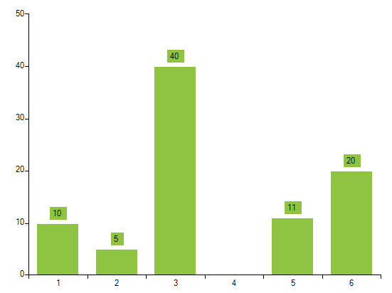

# Null Values Support

__RadChartView__ supports empty values in the series. In general empty values means missing Y value for a particular X value.

#### Data Containing Null

<snippet id='chartview-null-values-support-nullvalues-cs'/>
<snippet id='chartview-null-values-support-nullvalues-vb'/>

>caption Figure 1: BarSeries With Null DataPoint

The empty X value is skipped from drawing. NullValues is supported only for Cartesian series like Bar, Line, Spline, Area and SplineArea.

>caution Empty values for financial series is unsupported scenario. OHLC and Candlestick series always know their Open, Close, High and Low values, so  there is no valid scenario with empty values for this type of visualization.
>Empty values for pie chart are unsupported as well. Pie slices should always make up to 360 degrees when combined.
>

>caution In VB.NET one should be careful when using the *nullable* value types. Unless the object is not explicitly set as *nullable* its value will be implicitly cast to the default value for the data type. 
>

# See Also

* [Series Types]()
* [Axes]()
