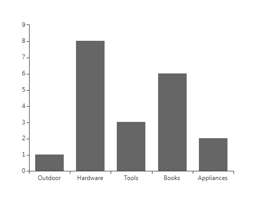
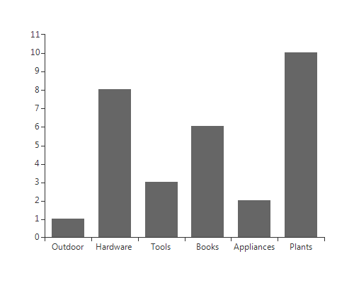

# Binding to BindingList

BindingList is a generic list type, that provides additional control over list items, i.e. the items in __RadChartView__ can be easily edited, removed or added. BindingList also surfaces events that notify when the list has been changed. The example below creates a list of MyCustomObject, initializes the list and assigns it to the __BarSeries__ object in __RadChartView__. 

<snippet id='chartview-binding-to-bindinglist-binding-cs'/>
<snippet id='chartview-binding-to-bindinglist-binding-vb'/>

>caption Figure 1: Binding to BindingList

In order to allow __RadChartView__ to automatically reflect changes in the data source, your object should implement the INotifyPropertyChanged interface: 

#### Binding to BindingList

<snippet id='chartview-binding-to-bindinglist-customclass-cs'/>
<snippet id='chartview-binding-to-bindinglist-customclass-vb'/>

Once the interface is implemented and your collection implement IBindingList, just like the BindingList does, changes are automatically reflected. Here is a sample of adding a new record: 

#### Add Item

<snippet id='chartview-binding-to-bindinglist-addingnewrecord-cs'/>
<snippet id='chartview-binding-to-bindinglist-addingnewrecord-vb'/>

>caption Figure 2: Reflect Object Changes

# See Also

* [Getting Started]()
* [Binding to DataTable]()

