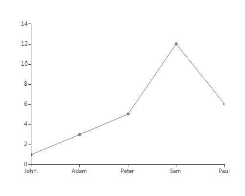
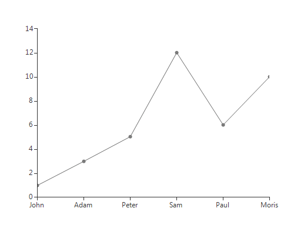

# Binding to DataTable

Binding to DataTable is quite easy with __RadChartView__. Once your table is created, you just need to set the needed members to the desired fields. In [this article]() , you can find the members needed for the different series types.

Here is a sample demonstrating how to bind а [LineSeries](): 

#### Binding to DataTable

{{source=..\SamplesCS\ChartView\DataBinding\ChartViewDataBindingToDataTable.cs region=binding}} 
{{source=..\SamplesVB\ChartView\DataBinding\ChartViewDataBindingToDataTable.vb region=binding}}

````C#
DataTable table;
protected override void OnLoad(EventArgs e)
{
    base.OnLoad(e);
    table = new DataTable();
    table.Columns.Add("Value", typeof(double));
    table.Columns.Add("Name", typeof(string));
    table.Rows.Add(1, "John");
    table.Rows.Add(3, "Adam");
    table.Rows.Add(5, "Peter");
    table.Rows.Add(12, "Sam");
    table.Rows.Add(6, "Paul");
    LineSeries lineSeria = new LineSeries();
    radChartView1.Series.Add(lineSeria);
    lineSeria.ValueMember = "Value";
    lineSeria.CategoryMember = "Name";
    lineSeria.DataSource = table;
}

````
````VB.NET
Private table As DataTable
Protected Overrides Sub OnLoad(e As EventArgs)
    MyBase.OnLoad(e)
    table = New DataTable()
    table.Columns.Add("Value", GetType(Double))
    table.Columns.Add("Name", GetType(String))
    table.Rows.Add(1, "John")
    table.Rows.Add(3, "Adam")
    table.Rows.Add(5, "Peter")
    table.Rows.Add(12, "Sam")
    table.Rows.Add(6, "Paul")
    Dim lineSeria As New LineSeries()
    RadChartView1.Series.Add(lineSeria)
    lineSeria.ValueMember = "Value"
    lineSeria.CategoryMember = "Name"
    lineSeria.DataSource = table
End Sub

````

{{endregion}} 

>caption Figure 1: Binding to DataTable


Adding, removing or modifying a record in the DataTable is automatically reflected in __RadChartView__:

>caption Figure 2: Modify Item


# See Also

* [Getting Started]()
* [Binding to BindingList]()
