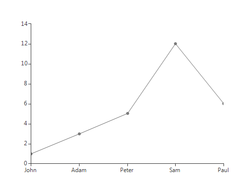
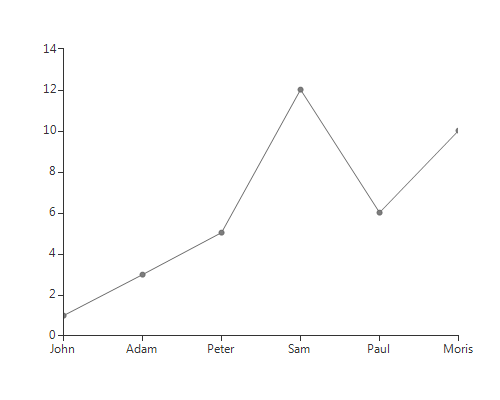

# Binding to DataTable

Binding to DataTable is quite easy with __RadChartView__. Once your table is created, you just need to set the needed members to the desired fields. In [this article]() , you can find the members needed for the different series types.

Here is a sample demonstrating how to bind а [LineSeries](): 

#### Binding to DataTable

<snippet id='chartview-binding-to-datatable-binding-cs'/>
<snippet id='chartview-binding-to-datatable-binding-vb'/>

>caption Figure 1: Binding to DataTable

Adding, removing or modifying a record in the DataTable is automatically reflected in __RadChartView__:

>caption Figure 2: Modify Item

# See Also

* [Getting Started]()
* [Binding to BindingList]()
