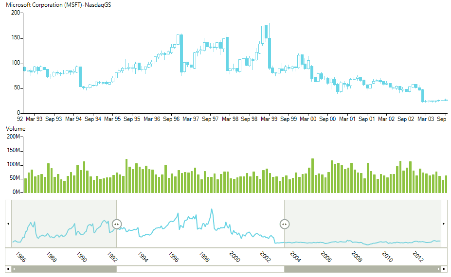

# Range Selector Integration

__RadChartView__ can be associated with a __RadRangeSelector__ control. This integration is extremely useful in scenarios requiring the end-users to deal with large data sets in __RadChartView__. __RadRangeSelector__ creates a mini-map of the chart data allowing quick scrolling and navigation along the view port of the chart. This way a particular portion of the data can be instantly displayed in a user-friendly manner.   

>caption Figure 1: Range Selector Integration

>important Detailed information on how __RadRangeSelector__ can be setup to be associated with __RadChartView__ is available in the following section of our documentation: [RadRangeSelector]().

# See Also
* [RadRangeSelector]() 
* [Series Types]()
* [Axes]()