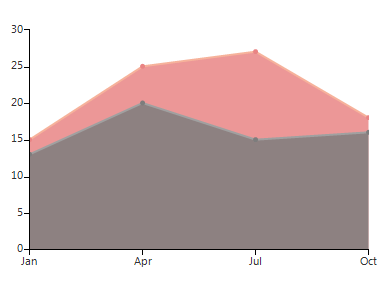
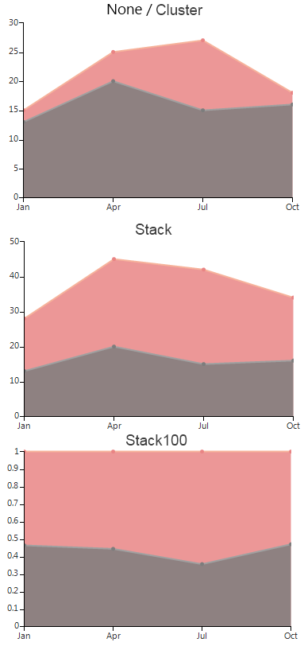

# Area

As a derivative of __Categorical__ series, __AreaSeries__ plot their data points using category-value couples. Once positioned on a plane the points are connected to form a line. Further, the area enclosed by this line and the categorical axis is filled. Below is a sample snippet that demonstrates how to set up two __AreaSeries__:

#### Initial Setup

<snippet id='chartview-area-area-cs'/>
<snippet id='chartview-area-area-vb'/>

>caption Figure 1: Initial Setup

The essential properties of AreaSeries coincide with these of LineSeries:

* __BorderWidth__: The property determines the thickness of the lines;

* __PointSize__: The property denotes the size of the points;

* __Spline__: Boolean property, which indicates whether the series will draw straight lines or smooth curves;

* __SplineTension__: The property sets the tension of the spline. The property will have effect only if the __Spline__ is set to *true*;

* __CombineMode__: A common property for all categorical series, which introduces a mechanism for combining data points that reside in different series, but have the same category. The combine mode can be *None*, *Cluster*,  *Stack* and *Stack100*. In the case of *AreaSeries*, *None* and *Cluster* mean that the series will be plotted independently of each other, so that they are overlapping. *Stack* plots the points on top of each other and *Stack100* presents the values of one series as a percentage of the other series. The combine mode is best described by a picture: 

>caption Figure 2: Combine Mode

# See Also

* [Series Types]()
* [Populating with Data]()
