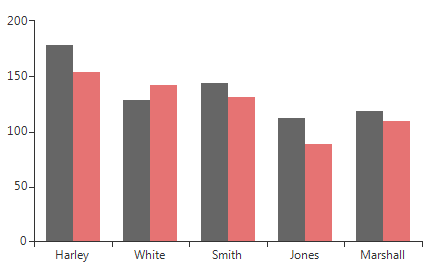
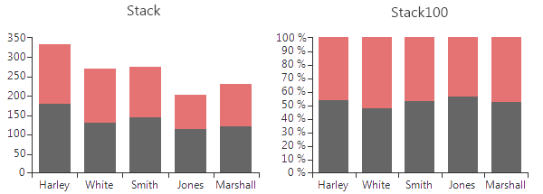
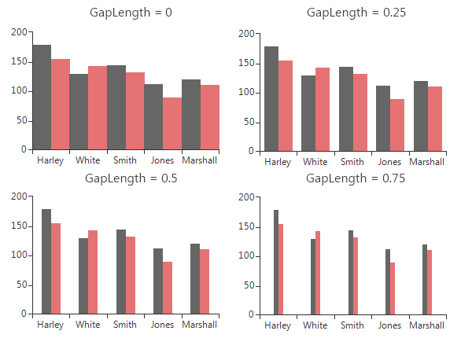
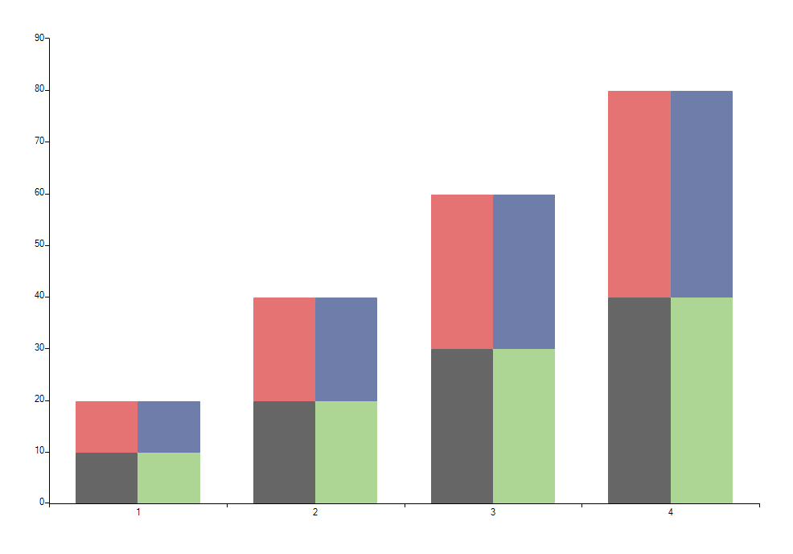

# Bar

__BarSeries__ are used to visualize data points as bar blocks where the height of each bar denotes the magnitude of its value. As a descendant of Categorical series, Bars require one categorical and one numerical axis. The following snippet demonstrates how to manually populate two __BarSeries__: 

#### Initial Setup

<snippet id='chartview-bar-bar-cs'/>
<snippet id='chartview-bar-bar-vb'/>

>caption Figure 1: Initial Setup

__BarSeries__ could be customized using the following properties:

* __ShowLabels__: A Boolean property that indicates whether the labels of each bar should be displayed. The specific position of the labels is determined by the orientation (vertical or horizontal) and the CombineMode (None, Cluster, Stack, Stack100) of the bars.

* __LabelMode__: Gets or sets the label mode of the __BarSeries__. It offers enumeration of three options: 
    - *Default* - Labels are positoned using the default strategy.
    - *Center* - Each label is renderred at the center of its corresponding bar.
    - *Top* - Each label is renderred at the top of its corresponding bar. If the area orientation is horizontal, the labels appear on the right of each bar.

* __CombineMode__: A common property for all categorical series, which introduces a mechanism for combining data points that reside in different series but have the same category. The combine mode can be __None__, __Cluster__, __Stack__ and __Stack100__. __None__ means that the series will be plotted independently of each other, so that they are overlapping. __Cluster__ displays data points in the same category  huddled close together. __Stack__ plots the points on top of each other and __Stack100__ will display the value as percent. The combine mode is best described by a picture (Left - Stack, Right – Stack100).

>caption Figure 2: Combine Mode 

* __GapLength__: A property exposed by both __CategoricalAxis__ and __DateTimeContinuousAxis__, which controls the distance between bar groups as percent. Note that the value should be between 0 and 1, where a value of 0 means that a bar would take the entire space between two ticks, while a value of 1 means the bar will have zero width as all the space should appear as gap. Here is how to set the GapLength.

#### Setting GapLength

<snippet id='chartview-bar-gaplength-cs'/>
<snippet id='chartview-bar-gaplength-vb'/>

The following image demonstrates how different values of the __GapLength__ property change the __BarSeries__:

>caption Figure 3: Gap Length

* __StackGroupKey__ all cartesian series that support stacking can be grouped in separate stacks. Here are four __BarSeries__ stacked into two groups:

>caption Figure 4: Stacked BarSeries

To achieve this add four __BarSeries__ and set the __StackGroupKey__ property of two of them to 1.
            
# See Also

* [Series Types]()
* [Populating with Data]()
* [How to Rotate the Labels for BarSeries]()
