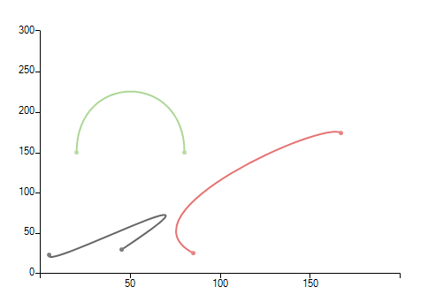

# Bezier

The Bezier chart displays a series of points on a curved line.  Two "control points" determine the position and amount of curvature in the line between end points.

#### Initial Setup
 
<snippet id='chartview-bezier-bezier-cs'/>
<snippet id='chartview-bezier-bezier-vb'/>

>caption Figure 1: Initial Setup

 
Here are some of the important properties of __BezierSeries__:

* __ControlPoint1XMember:__ If a DataSource is set, the property determines the name of the field that holds the X coordinate of ControlPoint1.

* __ControlPoint1YMember:__ If a DataSource is set, the property determines the name of the field that holds the Y coordinate of ControlPoint1.

* __ControlPoint2XMember:__ If a DataSource is set, the property determines the name of the field that holds the X coordinate of ControlPoint2.

* __ControlPoint2YMember:__ If a DataSource is set, the property determines the name of the field that holds the Y coordinate of ControlPoint2.

* __XValueMember:__ If a DataSource is set, the property determines the name of the field that holds the XValue.

* __YValueMember:__ If a DataSource is set, the property determines the name of the field that holds the YValue.

# See Also

* [Series Types]()
* [Populating with Data]()
