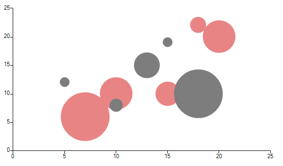

# Bubble

__BubbleSeries__ are used to visualize data points as points with coordinates and size defined by their items' values. You might think of a Bubble chart as a variation of the Scatter chart, in which the data points are replaced with bubbles. 

#### Initial Setup
 
<snippet id='chartview-bubble-bubble-cs'/>
<snippet id='chartview-bubble-bubble-vb'/>

>caption Figure 1: Initial Setup

 
Here are some of the important properties of __BubbleSeries__:

* __XValueMember:__ If a DataSource is set, the property determines the name of the field that holds the XValue.

* __YValueMember:__ If a DataSource is set, the property determines the name of the field that holds the YValue. 

* __ValueMember:__ If a DataSource is set, the property determines the name of the field that holds the Value.

* __AutoScale:__ Defines whether the size of the bubbles is calculated automatically by the chart engine or by the __Scale__ property.

* __Scale:__ Specifies a fixed scale for the relation between the size of the bubbles and their value when the __AutoScale__ property is set to *false*.

* __AutoScaleMaxWidth:__ The maximum size in pixels of a single bubble when __AutoScale__ is *true*.
            
# See Also

* [Series Types]()
* [Populating with Data]()
