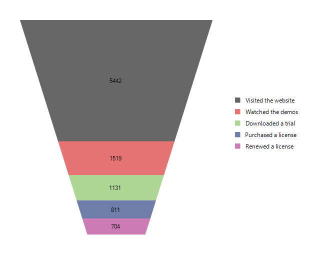

# Funnel

A funnel chart displays a single series of data in progressively decreasing or increasing proportions, organized in segments, where each segment represents the value for the particular item from the series. The items' values can also influence the height and the shape of the corresponding segments. 

>caption Figure 1: FunnelSeries

The funnel series has several properties that control the way a chart's segments are rendered.

* __SegmentSpacing:__ Specifies the space between the different segments of the funnel chart in pixels.

* __DynamicHeight:__ A Boolean property that indicates whether all the segments will share the same size (when DynamicHeightEnabled=*false*) or the height of each segment is determined according to its value (when DynamicHeightEnabled=*true*). Default value is *true*.

* __DynamicSlope:__ A Boolean property that indicates whether the form of each segment will be based on the ratio between the value from the current and the next segment. Default value is *false*.

* __NeckRatio:__ The property specifies the ratio between the top and the bottom bases of the whole funnel series The property can take effect only if the __DynamicSlope__ property is set to *false*.

The following example shows how you can add funnel series in code. 

#### Initial Setup

<snippet id='chartview-funnel-funnel-cs'/>
<snippet id='chartview-funnel-funnel-vb'/>

# See Also

* [Series Types]()
* [Populating with Data]()

